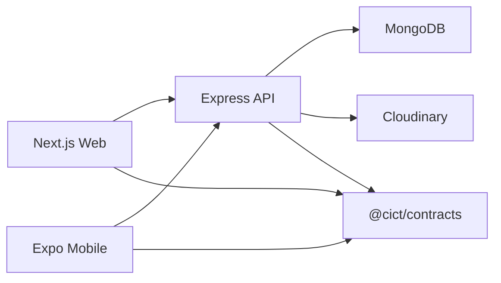
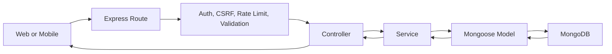
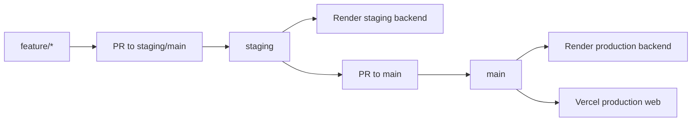

# CICT Developer Guide

Last updated: 2026-06-01

This guide is the starting point for new developers joining the CICT codebase. It explains what the system does, how the monorepo is organized, how the apps connect, and how to run and verify the project locally.

For deeper module-by-module status, use `CICT_SYSTEM_DOCUMENTATION.md`. For CI/CD and branch rules, use `AGENTS.md` and `CICT_CICD_PIPELINE.md`.

## 1. What This System Is

CICT is a full-stack platform for the College of Information and Communication Technology. It currently supports:

- A public website for news, announcements, events, organizations, members, and college information.
- An admin CMS for managing content, users, roles, students, events, approvals, organizations, and organization operations.
- A student-facing mobile app for login, event browsing, registration, QR attendance, updates, organizations, and settings.
- Shared TypeScript and Zod contracts used by backend, web, and mobile so API shapes stay aligned.

Some expansion phases are implemented as a baseline, and some are still planned:

- Implemented baseline: organization admin tools, organization analytics, inter-organization collaboration.
- Planned: cross-institutional collaboration, unified role-based calendar, external calendar integrations.

## 2. Monorepo Map

The repository is a pnpm workspace.

| Path | Purpose |
|---|---|
| `apps/backend` | Express 5 API, MongoDB models, services, routes, auth, uploads, student/admin APIs |
| `apps/web` | Next.js 15 public website, admin CMS, student web pages, shared UI/components |
| `apps/mobile` | Expo React Native student app |
| `packages/contracts` | Shared TypeScript enums, interfaces, and Zod schemas |
| `packages/tsconfig` | Shared TypeScript compiler configuration |
| `packages/eslint-config` | Shared ESLint flat configuration |
| `docs` | Developer-facing technical docs |
| `apps/web/docs/implementation` | Phase roadmaps and implementation notes |
| `cict_website_documentation` | Product/business documentation set |

## 3. Simple Architecture



The backend is the system of record. The web app and mobile app should call backend APIs instead of duplicating backend behavior. Shared contracts should be updated when an API shape, enum, role, permission, or shared response changes.

## 4. Request Flow

Most backend requests follow this path:



In practice:

1. The client calls an API through an API helper or service.
2. Express receives the request through a route mounted in `apps/backend/src/app.ts`.
3. Middleware handles request ID, security headers, CORS, rate limiting, cookies, CSRF, auth, permissions, and validation.
4. Controllers translate HTTP input/output.
5. Services contain business logic and database operations.
6. Mongoose models read/write MongoDB.
7. The response returns as JSON to web or mobile.

## 5. Backend Overview

Backend code lives in `apps/backend/src`.

Important folders:

| Folder | What belongs there |
|---|---|
| `routes` | Express route definitions and middleware chains |
| `controllers` | Request/response handlers |
| `services` | Business logic, access checks, aggregation, database writes |
| `models` | Mongoose schemas and indexes |
| `validators` | Request validation rules |
| `middleware` | Auth, permissions, CSRF, rate limiters, error handling |
| `config` | Database and environment validation |
| `utils` | Shared backend helpers |
| `tests` | Backend integration and unit tests |

Core backend areas:

- Admin auth and user management: auth, users, roles, permissions.
- Content CMS: news, announcements, events, FAQs, uploads, approvals.
- Student APIs: student login, profile, events, registration, attendance, push tokens.
- Organization APIs: organizations, memberships, tasks, meetings, votes, budget, templates.
- Expansion APIs: analytics, partnerships, collaboration spaces, shared content, resources, mentorship, task forces.
- Security/ops: Helmet, CORS, rate limiting, CSRF, request IDs, logging, maintenance mode.

Backend route mounting happens in `apps/backend/src/app.ts`. If a new route file is added, it must be mounted there.

## 6. Web Overview

Web code lives in `apps/web/src`.

Important folders:

| Folder | What belongs there |
|---|---|
| `app` | Next.js App Router pages and layouts |
| `components` | Shared UI, admin components, organization components, page sections |
| `lib/api` | API clients for backend calls |
| `hooks` | Auth, permissions, UI, and data hooks |
| `lib/query-keys.ts` | TanStack Query cache key namespaces |
| `types` | Web-side TypeScript types |
| `test` | Web test setup and mocks |

Major web surfaces:

- Public pages: home, news, announcements, events, organizations, members, contact, and informational pages.
- Admin CMS: dashboard, content management, students, users, roles, logs, approvals, processes, settings, organizations.
- Organization admin pages: tasks, meetings, voting, budget, templates, analytics, partnerships, collaboration, shared content, resources, mentorship, task forces.
- Student web pages: login, events, registrations, attendance, profile, organizations, memberships.

Web data usually flows through `apps/web/src/lib/api/*` and TanStack Query. Permission-sensitive UI should use the permission helpers in `apps/web/src/hooks/permissions`.

## 7. Mobile Overview

Mobile code lives in `apps/mobile`.

Important folders:

| Folder | What belongs there |
|---|---|
| `app` | Expo Router screens and navigation layouts |
| `src/components` | Reusable mobile UI components |
| `src/features` | Feature-level mobile code |
| `src/services` | Mobile API clients and service helpers |
| `src/store` | Client state |
| `src/theme` | Mobile theme and brand tokens |
| `docs` | Mobile-specific architecture, setup, and design notes |

The mobile app is student-facing. It covers student authentication, home dashboard, updates, organizations, event browsing, event registration/cancellation, QR attendance pass, attendance history, settings, and logout.

Mobile must reuse backend APIs and shared contracts. It should not import business logic from `apps/web`.

## 8. Shared Contracts

Shared contracts live in `packages/contracts/src/index.ts`.

Use this package for:

- User roles and permissions.
- Content owner/status enums.
- Event, news, announcement, student, organization, membership, process, and attendance types.
- Zod schemas for API request/response validation.

When changing an API shape:

1. Update `packages/contracts` first when the shape is shared.
2. Build contracts with `pnpm run contracts:build`.
3. Update backend response/input logic.
4. Update web/mobile API clients and screens.
5. Run typechecks for the affected apps.

## 8A. Lookup And Form Protocol

Admin forms must not invent their own dropdown sources. Use the [Lookup Protocol](LOOKUP_PROTOCOL.md) when adding or changing form fields.

Simple rule:

- Real records use backend lookups, such as organizations, users, students, events, news, tasks, and meetings.
- Configurable business labels use settings reference data, such as resource types, committees, partnership types, mentorship focus areas, and content categories.
- Workflow states use shared contract enums, such as status, priority, owner type, and permissions.

The canonical admin lookup API is `GET /api/admin/lookups/:kind`. Shared frontend controls live in `apps/web/src/components/ui/lookup-combobox.tsx` and `apps/web/src/components/ui/reference-data-select.tsx`.

Before saving a form change, confirm that backend validation uses the same source shown by the frontend and that edit mode hydrates readable selected labels.

## 9. Local Development

### Prerequisites

- Node.js 20+
- pnpm 10+
- Docker, if using local MongoDB

### Install

```bash
corepack enable
pnpm install
```

### Environment Files

Copy examples and fill in local values:

```bash
cp apps/backend/.env.example apps/backend/.env
cp apps/web/.env.example apps/web/.env.local
cp apps/mobile/.env.example apps/mobile/.env
```

Typical local values:

- Backend: MongoDB URI, JWT secrets, session secret, Cloudinary keys if uploads are used.
- Web: `NEXT_PUBLIC_API_URL=http://localhost:5000/api`.
- Mobile: `EXPO_PUBLIC_API_URL` pointing to a reachable backend URL.

### Run Backend and Web

Terminal 1:

```bash
pnpm run backend:mongo:up
pnpm run backend:dev
```

Terminal 2:

```bash
pnpm run web:dev
```

Open:

- Web: `http://localhost:3000`
- API: `http://localhost:5000/api`
- Health: `http://localhost:5000/health`

### Seed Data

```bash
pnpm run backend:seed
```

Seeded admin credentials are documented in `apps/web/README.md`.

### Run Mobile

Start the backend first, then:

```bash
pnpm run mobile:dev
```

For phone testing from WSL or a different device, expose the backend:

```bash
pnpm run backend:tunnel
```

Use the printed tunnel URL as `EXPO_PUBLIC_API_URL`, with `/api` at the end.

## 10. Quality Checks

Use root scripts when checking the whole workspace:

```bash
pnpm run lint
pnpm run typecheck
pnpm run test
pnpm run build
```

Use focused scripts when checking one app:

```bash
pnpm run backend:lint
pnpm run backend:typecheck
pnpm run backend:test
pnpm run backend:build

pnpm run web:lint
pnpm run web:typecheck
pnpm run web:test
pnpm run web:build

pnpm run mobile:lint
pnpm run mobile:typecheck
pnpm run mobile:test
```

The root build currently builds contracts, backend, and web. Mobile has its own Expo commands.

## 11. Deployment Overview

Branch flow:



High-level deployment rules:

- Pull requests to `staging` or `main` run CI checks.
- Pushes to `staging` deploy the backend to Render staging.
- Pushes to `main` deploy the backend to Render production and the web app to Vercel production.
- Frontend staging may be handled separately depending on deployment setup.
- Mobile is developed and tested through Expo; production mobile release flow should be documented separately when finalized.

Required GitHub secrets and branch protection details live in `AGENTS.md` and `CICT_CICD_PIPELINE.md`.

## 12. First-Day Developer Checklist

1. Read `README.md` for the shortest quick start.
2. Read this guide to understand the architecture.
3. Skim `CICT_SYSTEM_DOCUMENTATION.md` for current module status.
4. Run `pnpm install`.
5. Copy env files and start MongoDB/backend/web.
6. Run `pnpm run contracts:build`.
7. Run `pnpm run backend:typecheck` and `pnpm run web:typecheck`.
8. Open the web app and confirm the backend health endpoint works.
9. Before changing API shapes, check `packages/contracts`.
10. Before changing permissions or org-scoped behavior, inspect both backend middleware/services and web permission hooks.

## 13. Where To Continue Reading

- `README.md` - quick start and command index.
- `CICT_SYSTEM_DOCUMENTATION.md` - deeper current-state system reference.
- `CICT_CICD_PIPELINE.md` - CI/CD status tracker.
- `AGENTS.md` - operational reference for agents and CI/CD.
- `apps/web/docs/implementation/MASTER_ROADMAP.md` - Phase 1-9 roadmap.
- `apps/web/docs/implementation/MASTER_ROADMAP_EXPANSION.md` - Phase 10+ expansion roadmap.
- `apps/mobile/docs/architecture.md` - mobile architecture notes.
- `apps/web/README.md` - web/backend environment and deployment notes.
- `apps/mobile/README.md` - mobile setup and phone testing notes.
