# CICT Portal Module Connection and Approval Flow Map

## Document Information

| Field | Details |
|---|---|
| Project | CICT Portal |
| Document Type | Module Connection and Approval Flow Map |
| Last Updated | 2026-06-09 |
| Source Audit | `../audits/CICT_WORKFLOW_ARCHITECTURE_AND_PROCESS_AUDIT.md` |

---

## 1. System-Level Architecture Flow

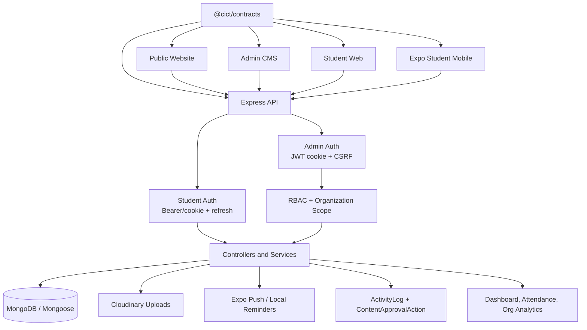

---

## 2. Module Dependency Map

| Source Module | Target Module | Data or Event | Trigger | Status | Notes |
|---|---|---|---|---|---|
| Admin Auth | Users/Roles | user id, role, permissions | login/profile | Connected | Active-user and deleted-role checks exist. |
| Users/Roles | Organization Assignment | scoped permissions | assign org role | Connected | Actor cannot assign permissions beyond own global scope. |
| News | Public Website/Mobile | published news | publish/read | Connected | Anonymous reads are status-filtered. |
| Announcements | Public Website/Mobile | published active notices | publish/read | Connected | Public route hides expired/inactive/unpublished. |
| Events | Student Registration | event eligibility/settings | student browses/registers | Connected | Published/upcoming and eligibility filters apply. |
| Student Registration | QR Pass | signed QR token | student opens ticket | Connected | Token includes event, registration, student, qrVersion, nonce. |
| QR Pass | Attendance Scan | token/manual student number | scanner submits | Connected | Backend validates event and duplicate state. |
| Attendance Scan | Reports/History | attendance logs/counts | scan/status correction | Partially Connected | UI export should call backend export endpoint. |
| Content Approval | Process Engine | content process instance | expected workflow link | Partially Connected | `processInstanceId` exists but lifecycle is not automatic. |
| Membership Applications | Approvals Page | pending applications | student applies | Partially Connected | Scoped route middleware mismatch. |
| Dashboard | User/content/event/org models | counts | dashboard load | Partially Connected | Cache key is not user/scope-specific. |
| Notifications | Mobile users | push/local messages | publish/register | Needs Manual Verification | Token registration and local reminders exist; delivery triggers need runtime proof. |

---

## 3. Authentication Flow

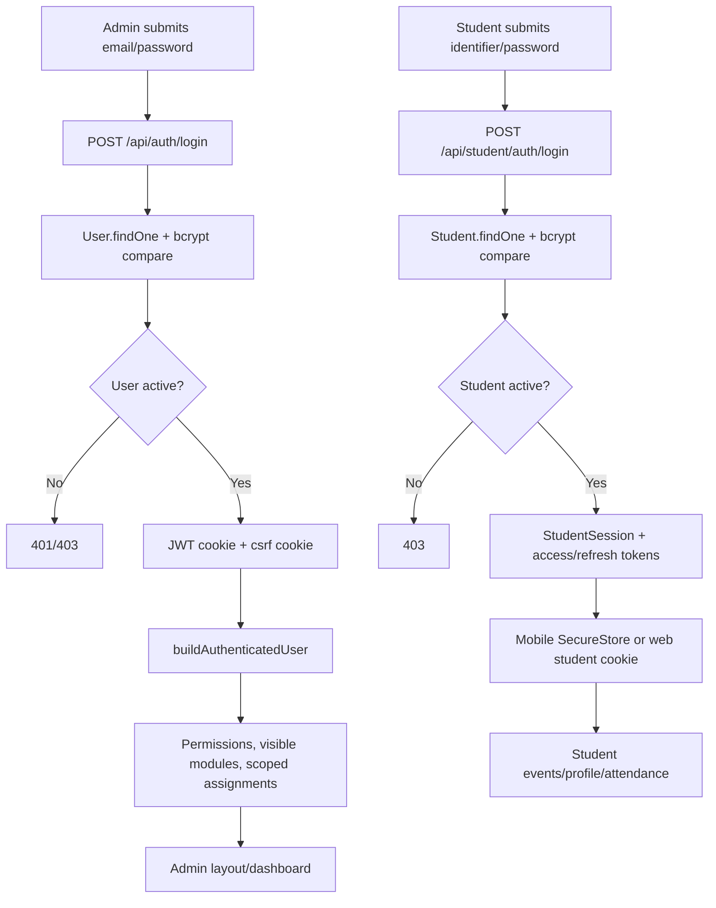

Admin and student auth are separated. Admin web is cookie-centered; mobile stores student access and refresh tokens in Expo SecureStore and refreshes through the centralized Axios client.

---

## 4. User, Role, and Permission Flow

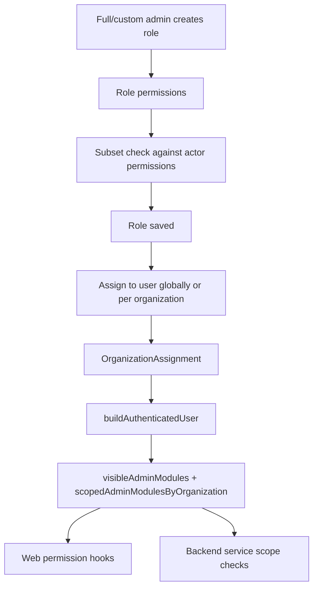

The core RBAC model is strong. The main follow-up is consistency: routes should not block scoped organization users before scope-aware service/controller checks can run.

---

## 5. Content-Creation and Publishing Flow

### News

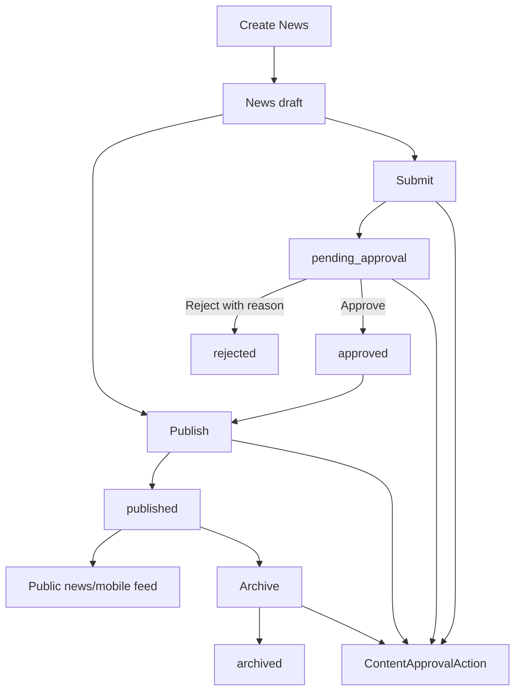

### Announcements

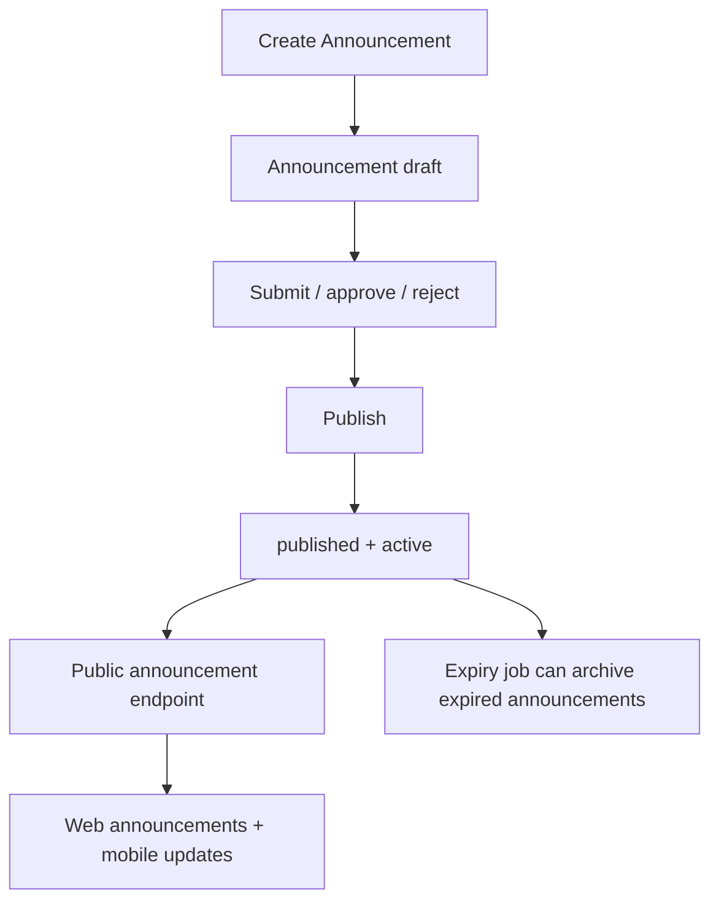

### Events

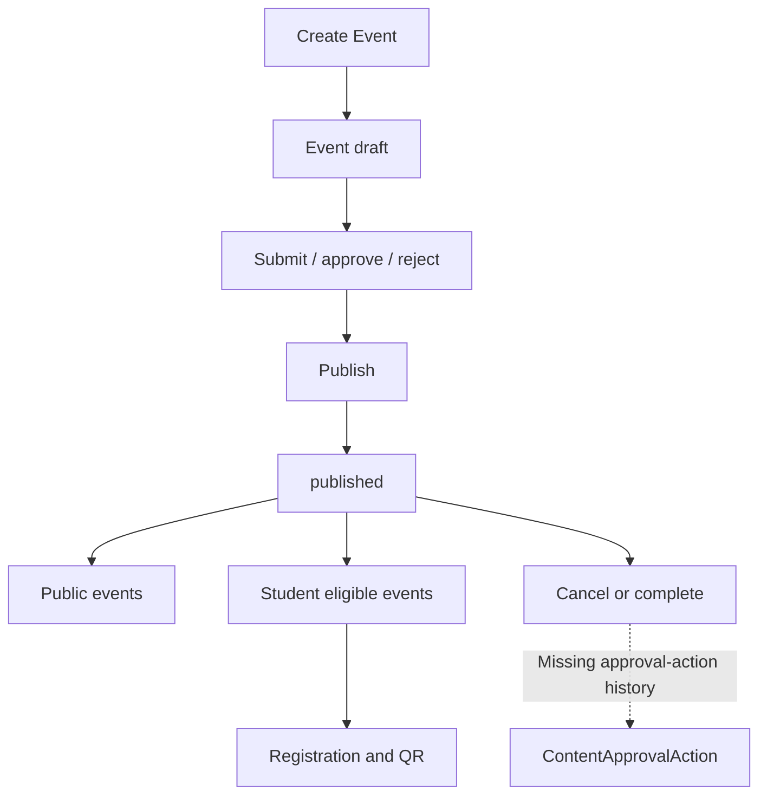

---

## 6. Event Lifecycle

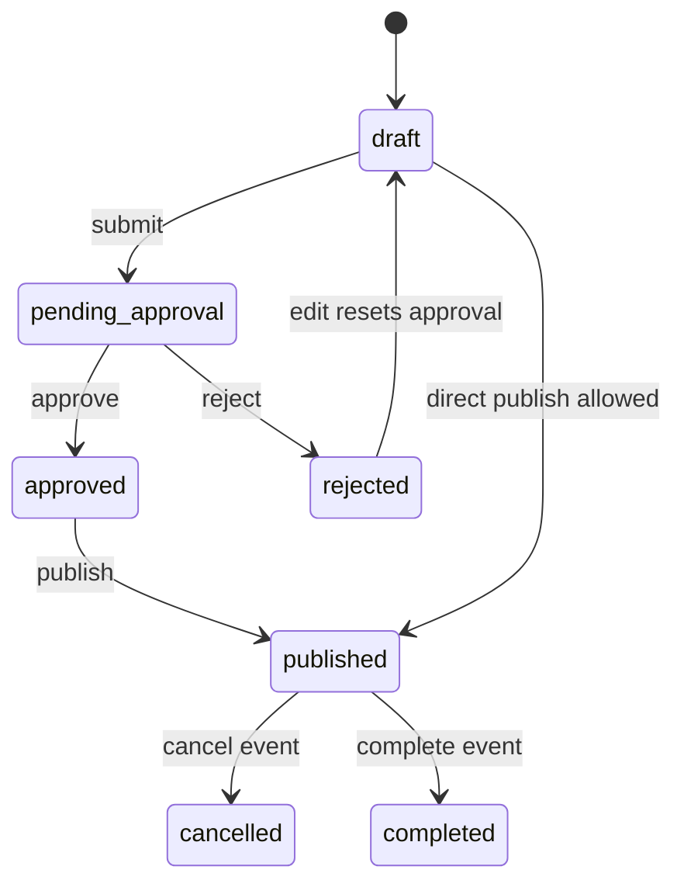

Events are connected to registration only after they are published and open for registration.

---

## 7. QR Generation and Attendance Flow

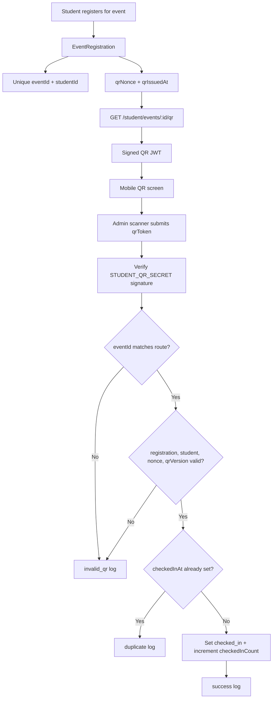

---

## 8. Student Mobile Identity Flow

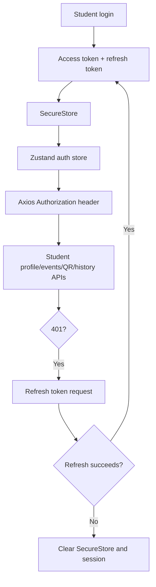

Student identity is server-backed through the `Student` model. The app does not create a local-only student profile for attendance.

---

## 9. QR Scanner and Attendance Validation Flow

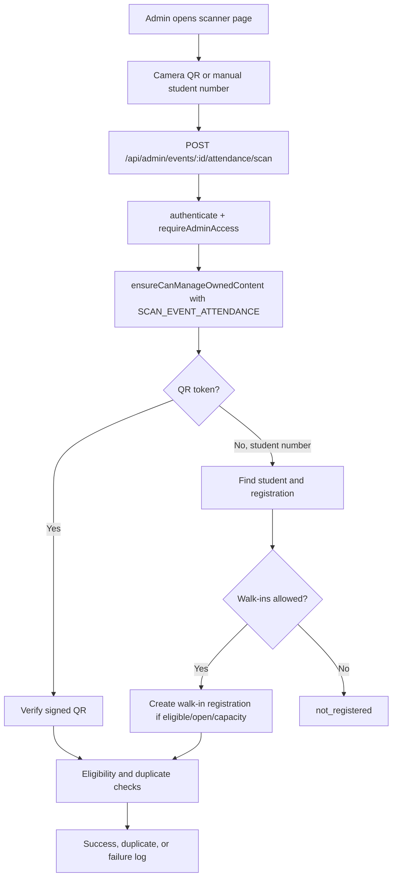

Missing UI connection: the scanner page should check `SCAN_EVENT_ATTENDANCE` before rendering scanner controls.

---

## 10. Attendance Reporting and Export Flow

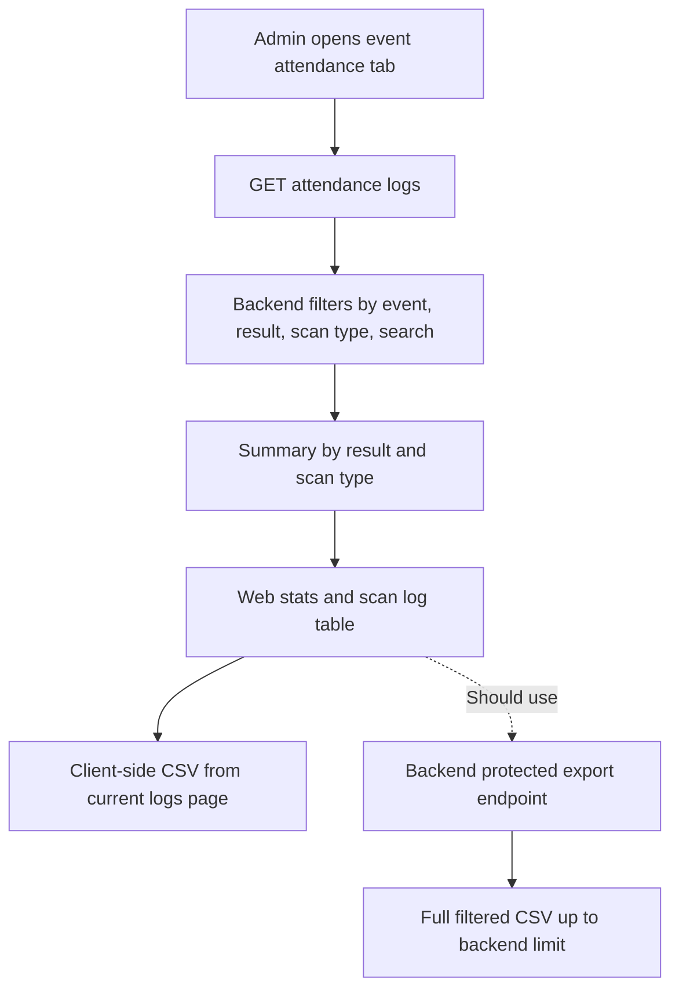

---

## 11. Notifications and Audit-Trail Flow

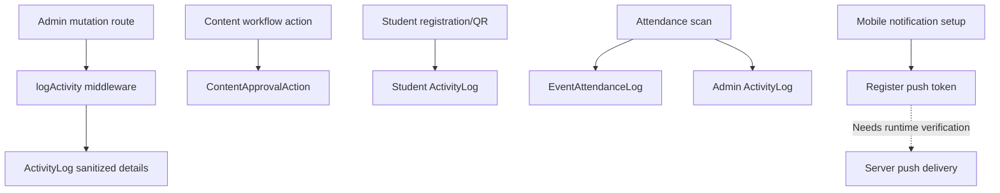

---

## 12. Dashboard Data Flow

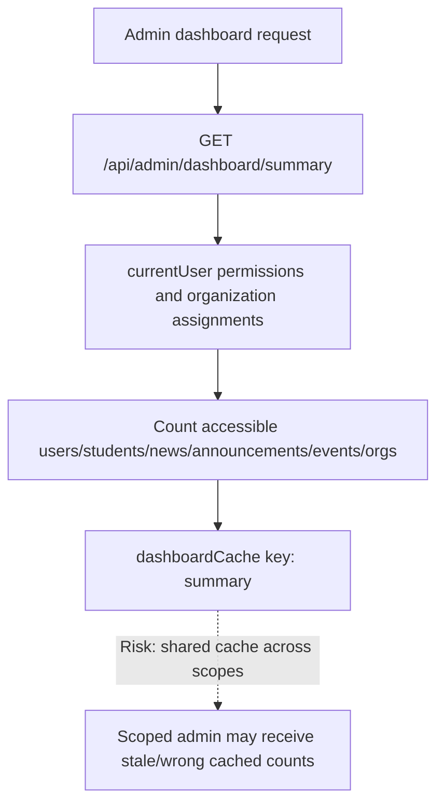

Recommended fix: include user id, global permission hash, and scoped organization ids in the dashboard cache key.

---

## 13. Process-Node and Approval Flow

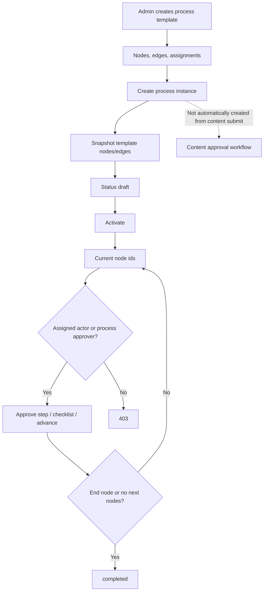

---

## 14. Disconnected Flow Map

| Flow ID | Source | Expected Target | Missing Connection | Impact | Recommended Action |
|---|---|---|---|---|---|
| CICT-DISC-001 | Dashboard count service | User/scope-specific cache | Cache key does not include user/scope | Scoped counts may leak or appear stale | Key cache by user and scope hash. |
| CICT-DISC-002 | Scanner page | `SCAN_EVENT_ATTENDANCE` permission | Web page uses general event module access | Confusing UI access and backend 403s | Add scan-specific permission guard. |
| CICT-DISC-003 | Membership approval route | Scoped controller check | Global `authorize` runs first | Scoped org admins blocked | Use scope-aware middleware/controller-only guard. |
| CICT-DISC-004 | Event cancel/complete | ContentApprovalAction history | No approval action write | Approval history incomplete | Record cancelled/completed actions. |
| CICT-DISC-005 | Attendance tab export | Backend CSV endpoint | Client builds CSV from loaded page | Incomplete exports | Call backend export endpoint. |
| CICT-DISC-006 | Content submit | Process instance | No automatic link/advance | Duplicate workflow systems | Decide integration policy. |
| CICT-DISC-007 | Push notification service | Runtime delivery proof | Imports/services found, delivery not executed | Notification expectations uncertain | Add tests/manual verification. |

---

## 15. Manual Verification Items

| Item | Reason | Owner | Status |
|---|---|---|---|
| QR camera scan in browser | Camera APIs and scanner component were not executed. | QA | Pending |
| Mobile QR offline token policy | Offline token cache risk requires policy decision. | Product/security | Pending |
| Scoped organization admin membership approval | Needs scoped-role fixtures. | Backend QA | Pending |
| Notification delivery | Requires device token and Expo/backend runtime. | Mobile/backend | Pending |
| Dashboard scoped cache behavior | Needs two-user integration scenario. | Backend QA | Pending |
| Process/content integration decision | Business workflow ownership is unclear. | Product owner | Pending |
| Attendance export privacy | CSV columns may expose student data. | Security/product | Pending |
