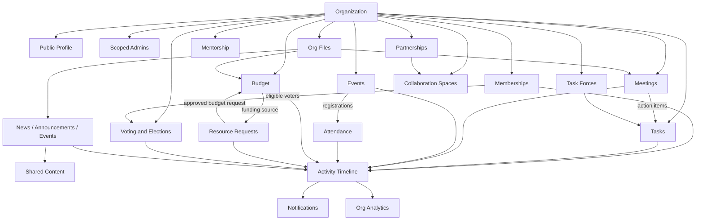
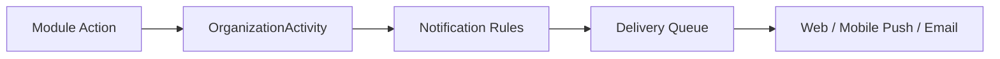

# CICT Organization System Connection Architecture

## Document Information

| Field | Details |
|---|---|
| Project | CICT Portal |
| Document Type | Organization System Architecture and Connection Map |
| Last Updated | 2026-06-10 |
| Related Plan | `../plans/CICT_ORGANIZATION_SYSTEM_IMPLEMENTATION_PLAN.md` |
| Related Storage Decision | `../plans/CICT_ORGANIZATION_STORAGE_BYOK_DECISION.md` |

---

## 1. Purpose

The organization system should behave as a connected operating system for CICT student organizations, not as separate isolated pages.

The target architecture is:

- one shared platform database;
- every organization-owned record scoped by `organizationId`;
- every major module able to link back to source records and related records;
- one organization dashboard that reads the connected modules;
- one activity timeline that explains what happened across the organization;
- one storage abstraction that can use platform-managed storage now and optional organization-owned storage later.

---

## 2. Current Organization Modules

The current system already has a broad organization feature set.

| Area | Existing Capability | Primary User |
|---|---|---|
| Organization profile | Public/admin organization metadata, logo, banner, mission, vision, values, officers, contact details | Public users, admins, students |
| Memberships | Student application, admin approval/rejection, active/resigned membership state | Students, org admins |
| Public members | Display officers/team members on org profile pages | Public users, admins |
| Scoped admins | Per-organization admin assignment and permissions | Super admins, org admins |
| Tasks | Organization task board, status, checklist, assignees, category, committee, meeting linkage | Org admins |
| Meetings | Meeting schedules, agenda, attendees, minutes, action items | Org admins |
| Voting | Election/vote setup, ballots, results | Org admins today; should include students later |
| Budget | Organization budget, categories, transactions, status history | Org admins, finance users |
| Analytics | Organization summary, task, event, financial, engagement, resource, partnership, collaboration, mentorship, shared-content analytics | Org admins |
| Partnerships | Organization-to-organization partnership lifecycle | Org admins |
| Collaboration spaces | Cross-org collaboration spaces and messages | Org admins |
| Shared content | Share news, announcements, and events between organizations | Org admins |
| Task forces | Cross-org task forces with participant organizations | Org admins |
| Resource pooling | Requests between organizations for venue, equipment, budget, personnel, or other resources | Org admins |
| Mentorship | Mentor and mentee organization relationships | Org admins |
| Templates | Apply reusable organization structures and color defaults | Super admins/org template managers |
| Mobile org discovery | Student-facing organization list and profile view | Students |

---

## 3. Main Connection Principle

Every organization-related record should be connectable by `organizationId` and, when useful, by a source link.

Recommended base fields for organization-owned records:

```ts
type OrganizationScopedRecord = {
  organizationId: string;
  ownerType?: 'system' | 'organization';
  createdBy?: string;
  updatedBy?: string;
  status?: string;
  visibility?: 'private' | 'organization' | 'public';
  sourceType?: OrganizationSourceType;
  sourceId?: string;
  relatedEntities?: RelatedEntityRef[];
  statusHistory?: StatusHistoryEntry[];
  activityLogId?: string;
  createdAt: Date;
  updatedAt: Date;
};

type OrganizationSourceType =
  | 'organization'
  | 'membership'
  | 'meeting'
  | 'meeting_action_item'
  | 'task'
  | 'event'
  | 'event_registration'
  | 'attendance'
  | 'budget'
  | 'budget_transaction'
  | 'resource_request'
  | 'vote'
  | 'partnership'
  | 'collaboration_space'
  | 'shared_content'
  | 'task_force'
  | 'mentorship'
  | 'template'
  | 'file'
  | 'process_instance';

type RelatedEntityRef = {
  type: OrganizationSourceType;
  id: string;
  label?: string;
  relation?: string;
};
```

This makes records dynamic because a meeting action item can create a task, a resource request can create a budget transaction, a vote can target active members, and analytics can trace all of it by organization.

---

## 4. Recommended System Flow



---

## 5. Organization Dashboard Model

The organization dashboard should not be a static overview page. It should aggregate the connected modules.

Recommended dashboard sections:

| Section | Data Sources | Purpose |
|---|---|---|
| Health summary | Memberships, tasks, meetings, events, budget, resources | Quick org status |
| Pending actions | Membership applications, resource requests, content approvals, overdue tasks | What needs attention |
| Calendar preview | Meetings, events, votes, deadlines | What is coming |
| Recent activity | Activity timeline | What changed recently |
| Budget snapshot | Budget, transactions, resource requests | Financial visibility |
| Membership snapshot | Applications, active members, resigned/alumni | Org membership health |
| Event performance | Events, registrations, attendance logs | Engagement tracking |
| Collaboration map | Partnerships, task forces, resource requests, mentorships | Cross-org visibility |

Recommended API shape:

```ts
type OrganizationDashboard = {
  organizationId: string;
  generatedAt: string;
  summary: {
    activeMembers: number;
    pendingApplications: number;
    overdueTasks: number;
    upcomingMeetings: number;
    upcomingEvents: number;
    activeVotes: number;
    pendingResourceRequests: number;
    budgetUtilization: number;
    engagementScore: number;
  };
  pendingActions: OrganizationActionItem[];
  recentActivity: OrganizationActivityItem[];
  calendar: OrganizationCalendarItem[];
  alerts: OrganizationAlert[];
};
```

---

## 6. Dynamic Connection Rules

### 6.1 Memberships to Voting

Student voting should use active membership as eligibility.

Recommended rule:

- only `OrganizationMembership.status === 'active'` can cast a student ballot;
- a student can only vote once per vote;
- admins can create/manage votes, but should not be the default voter type for student elections;
- alumni/advisors/honorary members should be explicitly included or excluded per vote settings.

Recommended vote fields:

```ts
eligibleMemberTypes: Array<'officer' | 'general' | 'alumni' | 'honorary' | 'advisor'>;
eligibleStatuses: Array<'active'>;
allowAdminBallots: boolean;
resultsVisibility: 'admins_only' | 'members_after_close' | 'public_after_close';
```

### 6.2 Meetings to Tasks

Meetings already have action items and tasks already have meeting references. The next step is to make this connection first-class.

Recommended behavior:

- a meeting action item can create or update an `OrgTask`;
- a linked task writes back completion state to the meeting action item;
- meeting minutes can show linked tasks;
- dashboard can count open meeting action items and overdue tasks together.

### 6.3 Events to Organizations

Organization-owned events should appear in:

- public organization profile;
- admin organization dashboard;
- mobile organization profile;
- org analytics;
- org calendar;
- activity timeline.

Recommended behavior:

- creating an event with `ownerType = 'organization'` requires `organizationId`;
- event approval uses organization-scoped permissions where applicable;
- published events appear on the organization public page and mobile page;
- attendance data contributes to engagement analytics.

### 6.4 Budget to Resource Requests

Resource requests should be able to connect to budget transactions.

Recommended behavior:

- a resource request with `resourceType = 'budget'` can create a pending budget transaction;
- approving the request marks or creates the transaction;
- cancelling/denying reverses or cancels the transaction reference;
- receipts and supporting files attach to both the request and transaction.

### 6.5 Shared Content to Content Approval

Shared content should preserve the original content state.

Recommended behavior:

- only approved or published content can be shared externally by default;
- drafts can be shared only within the owning organization if product policy allows it;
- incoming shared content should show source organization, content status, and publish status;
- removing a share should not delete the original content.

### 6.6 Files to All Modules

Files should be stored once as metadata records and then attached through references.

Recommended attached-file flow:

```ts
type OrgFileAttachment = {
  fileId: string;
  relation:
    | 'logo'
    | 'banner'
    | 'meeting_minutes'
    | 'event_asset'
    | 'receipt'
    | 'constitution'
    | 'report'
    | 'supporting_document';
};
```

---

## 7. Activity Timeline Architecture

The organization activity timeline is the simplest way to make the system feel connected.

Recommended model:

```ts
type OrganizationActivity = {
  organizationId: string;
  actorType: 'admin' | 'student' | 'system';
  actorId?: string;
  action:
    | 'created'
    | 'updated'
    | 'deleted'
    | 'submitted'
    | 'approved'
    | 'rejected'
    | 'published'
    | 'assigned'
    | 'completed'
    | 'cancelled'
    | 'shared'
    | 'uploaded'
    | 'voted'
    | 'joined'
    | 'resigned';
  entityType: OrganizationSourceType;
  entityId: string;
  entityLabel?: string;
  sourceType?: OrganizationSourceType;
  sourceId?: string;
  metadata?: Record<string, unknown>;
  createdAt: Date;
};
```

Recommended activity examples:

| Event | Activity Entry |
|---|---|
| Student applies to org | `joined/submitted`, entity `membership` |
| Admin approves application | `approved`, entity `membership` |
| Meeting creates action item | `created`, entity `meeting_action_item` |
| Action item becomes task | `created`, entity `task`, source `meeting_action_item` |
| Org publishes event | `published`, entity `event` |
| Event attendance scan succeeds | `completed`, entity `attendance` |
| Budget transaction added | `created`, entity `budget_transaction` |
| Resource request approved | `approved`, entity `resource_request` |
| Vote opens | `published`, entity `vote` |
| File uploaded | `uploaded`, entity `file` |

---

## 8. Notification Architecture

Notifications should be triggered from activity events, not separately hand-coded in every page.

Recommended notification flow:



Recommended notification targets:

| Trigger | Recipients |
|---|---|
| New membership application | Org admins with membership permission |
| Application approved/rejected | Student applicant |
| Task assigned | Assignee |
| Meeting scheduled/updated | Attendees and org admins |
| Vote opened | Eligible active members |
| Resource request received | Provider organization admins |
| Budget request approved | Requesting organization admins |
| Content approved/published | Content creator and org admins |

---

## 9. Storage Connection Architecture

Files should connect to organizations through metadata records, not through raw Cloudinary URLs scattered across modules.

Recommended storage metadata:

```ts
type OrganizationFile = {
  organizationId: string;
  provider: 'cloudinary' | 's3' | 'r2' | 'b2' | 'local_dev';
  storageMode: 'platform_managed' | 'organization_managed';
  bucketOrCloudName?: string;
  folder: string;
  publicId: string;
  url: string;
  secureUrl?: string;
  fileName: string;
  mimeType: string;
  sizeBytes: number;
  checksum?: string;
  uploadedBy: string;
  attachedTo?: RelatedEntityRef[];
  visibility: 'private' | 'organization' | 'public';
  lifecycleState: 'active' | 'archived' | 'deleted';
  createdAt: Date;
  updatedAt: Date;
};
```

Recommended folder convention:

```txt
orgs/{organizationId}/profile/logo/
orgs/{organizationId}/profile/banner/
orgs/{organizationId}/events/{eventId}/
orgs/{organizationId}/meetings/{meetingId}/
orgs/{organizationId}/budget/{fiscalYear}/receipts/
orgs/{organizationId}/documents/
orgs/{organizationId}/shared-content/
```

---

## 10. Database Strategy

Use one MongoDB database and scope data by `organizationId`.

Do not create one MongoDB database per organization at this stage.

Reasons:

- free-tier operations are easier with one database;
- cross-org analytics, collaboration, resource requests, and shared content need joins/queries across orgs;
- migrations and backups are simpler;
- indexes can isolate organization queries efficiently;
- per-org database isolation can be added later only if the project becomes large enough.

Recommended indexing pattern:

```ts
schema.index({ organizationId: 1, createdAt: -1 });
schema.index({ organizationId: 1, status: 1 });
schema.index({ organizationId: 1, sourceType: 1, sourceId: 1 });
```

For multi-organization records, keep canonical owner fields and participant fields:

```ts
organizationId: string;          // owner/creator org
participantOrgIds?: string[];    // additional connected orgs
targetOrgIds?: string[];         // shared content/resource targets
providerOrgId?: string;          // resource provider
```

---

## 11. Process Engine as Workflow Infrastructure

The Process tab should be kept, but it should be treated as workflow infrastructure rather than as a fully connected automation engine today.

Current state:

- process templates can define nodes and edges;
- process instances can be created from templates;
- instances can track status, current nodes, comments, requirements, and approval steps;
- process records can store `organizationId`, `linkedContentType`, and `linkedContentId`;
- node assignments exist in the data model for `user`, `role`, and `organization`.

Current limitation:

- runtime node access is still mostly direct-user based;
- the web assignee picker is primarily user-based;
- process links are not registered consistently across every organization module;
- process instances do not automatically create organization tasks, notifications, dashboard entries, or activity timeline events;
- content approval and process approval are still separate concepts.

Target role:

```txt
Process tab = reusable workflow infrastructure
Organization modules = business records
Activity timeline = event history
Notifications = delivery layer
Dashboard = operational summary
```

Recommended process connections:

| Process Use Case | Source Module | Process Role |
|---|---|---|
| Membership application review | Memberships | Optional application approval workflow |
| Event proposal | Events | Proposal, approval, revision, publish checklist |
| Budget request | Budget/resources | Financial approval and receipt requirements |
| Resource request | Resources | Provider review and fulfillment workflow |
| Officer handover | Memberships/files/tasks | Turnover checklist and document transfer |
| Document approval | Files/content | Required documents and review steps |
| Task force project | Task forces/tasks | Multi-step project workflow |
| Shared content approval | Shared content/content | Cross-org review before sharing/publishing |

Required upgrade pieces:

| Piece | Purpose |
|---|---|
| Participant resolver | Resolve `user`, `role`, `organization`, `committee`, `student_member`, and `officer_position` assignments into actual actors. |
| Module link registry | Define which modules can be linked to a process and how each module stores `processInstanceId`. |
| Process event emitter | Emit organization activity and notifications when process steps change. |
| Automation actions | Allow process nodes to create tasks, request documents, update statuses, and trigger reminders. |
| Scoped access rules | Ensure global admins and scoped organization admins can only see/act on allowed process instances. |

Recommended participant types:

```ts
type ProcessParticipantType =
  | 'user'
  | 'role'
  | 'organization'
  | 'organization_admin'
  | 'committee'
  | 'officer_position'
  | 'student_member'
  | 'student_applicant';
```

Recommended linked entity types:

```ts
type ProcessLinkedEntityType =
  | 'news'
  | 'announcement'
  | 'event'
  | 'task'
  | 'meeting'
  | 'budget'
  | 'budget_transaction'
  | 'resource_request'
  | 'membership_application'
  | 'vote'
  | 'file'
  | 'task_force'
  | 'partnership'
  | 'mentorship';
```

Architecture decision:

```txt
Keep the Process tab.
Do not make it the source of truth for every module immediately.
Use it as Phase 2/3 infrastructure after activity, dashboard, storage metadata, and core membership/voting flows are stable.
```

---

## 12. Permission Model

Organization operations should support both global admins and scoped organization admins.

Recommended permission check:

```txt
Allow if user has global permission
OR user has organization assignment for organizationId with that permission
```

Avoid route middleware that blocks scoped admins before the controller/service can check organization scope.

Recommended permission families:

| Permission Family | Scope |
|---|---|
| Organization profile | edit/delete org metadata |
| Membership | view applications, approve/reject, manage roles |
| Tasks | create/update/delete org tasks |
| Meetings | manage meetings, minutes, action items |
| Voting | create elections, manage candidates, view results |
| Student voting | cast vote if active member |
| Budget | manage budget and transactions |
| Resources | request/approve/deny resources |
| Content | manage org-owned news, announcements, events |
| Shared content | share/revoke content |
| Analytics | view org analytics |
| Files | upload/delete/manage org files |
| Storage settings | manage org storage provider and quotas |
| Processes | create templates, start instances, act on assigned steps, link modules |

---

## 13. What Needs Explanation in Product Docs

| Topic | Explanation Needed |
|---|---|
| Organization profile vs membership | Public officers/team members are different from student membership records. |
| Scoped admins | An admin may manage only selected organizations and selected tools. |
| Membership lifecycle | Students apply, admins approve/reject, active members may resign. |
| Voting | Admin election setup is different from student ballot casting. |
| Meetings and tasks | Meeting action items can become tasks and tasks can link back to meetings. |
| Budget and resources | Budget records track financial state; resource requests connect organizations. |
| Shared content | Sharing content references the source content; it does not duplicate ownership. |
| Analytics | Org analytics is computed from connected modules, not manually entered. |
| Storage | Files live in storage; MongoDB stores metadata and relationships. |
| BYOK/BYOS | Optional future feature for organizations that provide their own storage credentials. |
| Process tab | Reusable workflow infrastructure, not yet the central automation engine for every module. |

---

## 14. Architecture Decisions

| Decision | Recommendation |
|---|---|
| Database isolation | Use one shared MongoDB database with organization-scoped records. |
| Per-org MongoDB | Do not implement now. Reconsider only for strong compliance or scale requirements. |
| Storage | Use platform-managed Cloudinary initially with per-org folders and quotas. |
| BYOK/BYOS | Do not require now. Design storage abstraction so it can be added later. |
| Activity | Add organization activity timeline as the central connection layer. |
| Notifications | Trigger notifications from activity events. |
| Dashboard | Build a dynamic org dashboard from connected module summaries. |
| Mobile | Add student membership and voting flows after backend eligibility rules are finalized. |
| Process tab | Keep it, but treat it as Phase 2/3 infrastructure until participant resolver and module registry are added. |
