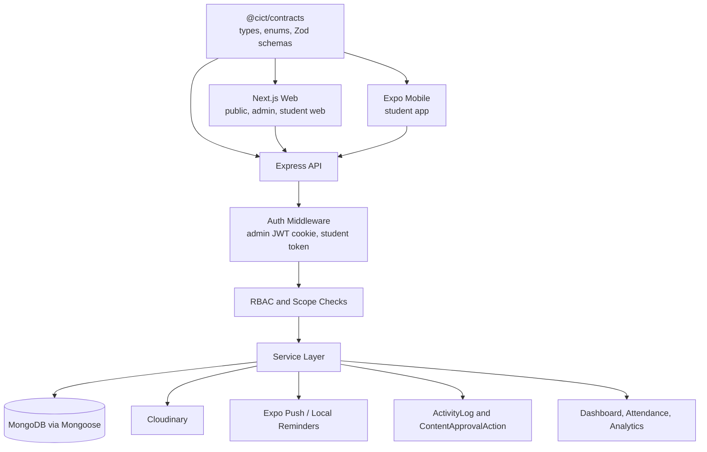
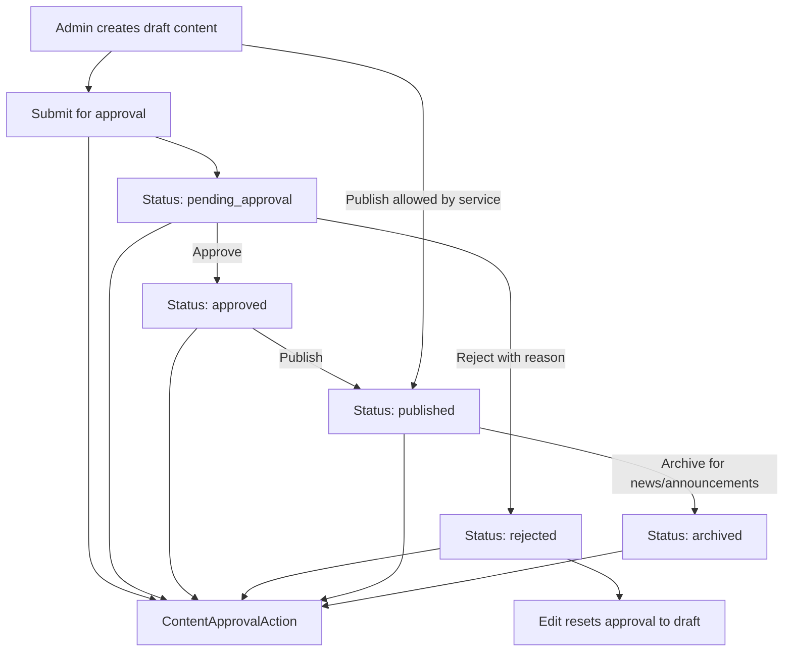
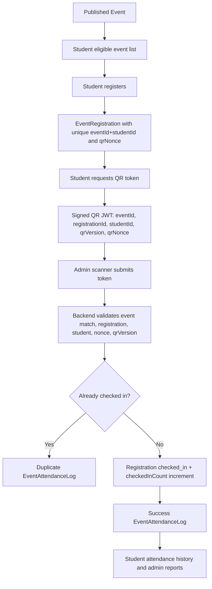

# CICT Portal Workflow, Architecture, and Process Audit

## Document Information

| Field | Details |
|---|---|
| Project | CICT Portal |
| Document Type | Workflow, Architecture, and Process Audit |
| Last Updated | 2026-06-09 |
| Repository Root | `/home/ronmarche14/projects/CICT` |
| Current Readiness Level | Feature-rich monorepo with real backend/web/mobile workflow coverage; not release-ready until RBAC, mobile/web typecheck, reporting/export, and manual approval verification gaps are closed. |
| Audit Scope | Repository evidence from `apps/backend`, `apps/web`, `apps/mobile`, `packages/contracts`, `.github/workflows`, root docs, web docs, mobile docs, and AI guidance files. |
| Audit Limitations | No database connection, no browser execution, no migrations, no seeds, no production/staging service access, no secret inspection beyond tracked placeholders, no fixes applied. |

---

## 1. Executive Summary

CICT is a pnpm workspace monorepo with a real Express/Mongoose backend, Next.js web portal, Expo student mobile app, and shared contracts. The strongest connected workflows are admin authentication, user/role management, news/announcement/event lifecycle, student event registration, QR ticket generation, admin attendance scanning, audit/activity logging, and student mobile event access.

The main architecture pattern is understandable: web and mobile call the Express API; Express routes use middleware, controllers, services, and Mongoose models; shared enums and schemas live in `@cict/contracts`. Content and attendance are not mock-only features: there are concrete models, status values, service checks, API clients, and UI entry points.

The main risks are workflow-policy consistency and release readiness:

- Many content routes use coarse `requireAdminAccess` at the route layer and rely on service methods for exact permission and organization-scope checks. This works where service checks are present, but it is easy to regress.
- Organization membership approval routes apply global `authorize(...)` middleware before scoped membership checks, which can block scoped organization admins even though the controller is scope-aware.
- Content approval and the process engine both exist, but content lifecycle does not automatically create or advance process instances.
- Event cancel/complete actions update event state but do not record `ContentApprovalAction` entries, unlike submit/approve/reject/publish/archive.
- QR attendance is connected and signed, but scanner UI access is broader than the backend scan permission; the backend enforces `SCAN_EVENT_ATTENDANCE`, while the page-level web guard currently uses general event-module access.
- Web attendance CSV export is generated client-side from the current page of logs, while the backend has a protected export endpoint. This can produce incomplete exports.
- Web and mobile typechecks are currently failing.

---

## 2. Repository Identification

| Field | Detected Value |
|---|---|
| CICT Repository Root | `/home/ronmarche14/projects/CICT` |
| Repository Type | pnpm monorepo with backend, web, mobile, and shared packages |
| Web Frontend Location | `/home/ronmarche14/projects/CICT/apps/web` |
| Backend or API Location | `/home/ronmarche14/projects/CICT/apps/backend` |
| Mobile Application Location | `/home/ronmarche14/projects/CICT/apps/mobile` |
| Database Location | MongoDB via Mongoose models in `/home/ronmarche14/projects/CICT/apps/backend/src/models`; migration scripts in `apps/backend/src/db` |
| Package Manager | `pnpm@10.18.3` from root `package.json` |
| Existing Audit Documents | `docs/FULL_AUDIT_REPORT.md`, `docs/system-logic-connectivity-audit.md`, web module audits in `apps/web/docs/*_AUDIT.md` |
| Existing Planning Documents | `docs/PHASED_REMEDIATION_EXECUTION_PLAN.md`, `docs/REMEDIATION_PLAN.md`, `plans/*.md`, `apps/web/docs/implementation/*.md`, `apps/mobile/docs/roadmap.md` |
| Existing AI Guidance Files | `AGENTS.md`, `apps/mobile/AGENTS.md`, `.agents/*.md`, `.opencode/agents/*.md`, `.opencode/skills/*/SKILL.md` |

`<detected-cict-root>` is `/home/ronmarche14/projects/CICT`.

---

## 3. Documentation Review

| Document | Status | Notes |
|---|---|---|
| `AGENTS.md` | Current | Defines CI/CD, scripts, staging/production expectations, and branch protection. |
| `README.md` | Mostly current | Correctly describes pnpm monorepo and stack; API default examples vary between `localhost:4000` and `localhost:5000` across files. |
| `docs/DEVELOPER_GUIDE.md` | Current | Strong source for architecture and request flow. |
| `docs/FULL_AUDIT_REPORT.md` | Historical/current mix | Useful prior audit; mobile build comments are partly outdated by current uncommitted mobile config evidence. |
| `docs/system-logic-connectivity-audit.md` | Current as of 2026-06-02 with 2026-06-06 notes | Accurately identifies connected modules and remaining workflow gaps. |
| `docs/PHASED_REMEDIATION_EXECUTION_PLAN.md` | Current remediation tracker | Lists security, organization ID, indexes, CI, mobile build, and test tasks. |
| `apps/mobile/docs/*.md` | Current mobile guidance | Covers API integration, SecureStore auth, mobile routing, brand parity, and roadmap. |
| `apps/web/docs/implementation/*.md` | Current/historical implementation roadmap | Phase docs include event QR, scanner, approval, mobile API, audit logging, and release checklist. |

No `docs/audits`, `docs/plans`, or `docs/architecture` folder existed before this audit. No `docs/plans/CICT_IMPLEMENTATION_ROADMAP.md` or `docs/audits/CICT_PORTAL_FULL_REPOSITORY_AUDIT.md` existed, so those allowlisted files were not created.

---

## 4. Verified Technology Stack

| Area | Verified Technology or Pattern | Main Files | Connected To | Risks or Notes |
|---|---|---|---|---|
| Monorepo | pnpm workspace | `package.json`, `pnpm-workspace.yaml` | `apps/*`, `packages/*` | Package-level scripts exist. |
| Backend | Express 5 + TypeScript | `apps/backend/src/app.ts`, `apps/backend/package.json` | Web/mobile/API clients | Route mounting is centralized. |
| Database | MongoDB + Mongoose | `apps/backend/src/models/*.ts` | Services/controllers | No DB executed during audit. |
| Web | Next.js 15 + React 19 | `apps/web/src/app`, `apps/web/package.json` | Backend via Axios/TanStack Query | Web typecheck currently fails in `calendar.tsx`. |
| Mobile | Expo SDK 54 + React Native | `apps/mobile/app`, `apps/mobile/src`, `apps/mobile/package.json` | Student backend APIs | Mobile typecheck currently fails in tests. |
| Shared Contracts | TypeScript/Zod package | `packages/contracts/src` | Backend, web, mobile | Contracts typecheck passed. |
| Auth | Admin JWT cookie; student bearer/cookie token | `auth.ts`, `studentAuth.ts`, `AuthContext.tsx`, mobile `client.ts` | Users/students/sessions | Admin refresh route exists in backend; prior docs should be kept in sync. |
| Authorization | Permission enum + custom roles + scoped org assignments | `Permission`, `rbac.ts`, `organizationScope.ts` | Admin routes/services | Some routes rely on service-level scope enforcement. |
| Validation | `express-validator` + Zod contracts | `apps/backend/src/validators`, `packages/contracts/src/schemas` | Routes and shared clients | Good coverage for major mutating routes. |
| Media | Cloudinary via multer | `upload.ts`, `upload.routes.ts` | CMS and organization images | Stale S3 findings appear resolved in prior docs. |
| Notifications | Expo push tokens + mobile local reminders | `pushToken.routes.ts`, `push-notification.service.ts`, mobile notifications | Student mobile | Delivery triggers are partial and need manual verification. |
| Reports | Dashboard summaries, attendance logs/export, org analytics | `dashboard.service.ts`, `admin-event-attendance.controller.ts`, `org-analytics.*` | Admin UI | Web attendance export is client-side page export, not backend full export. |
| CI/CD | GitHub Actions; Render; Vercel; mobile EAS workflow in worktree | `.github/workflows/*.yml`, `render*.yaml` | Staging/production/mobile | `.github/workflows/deploy-mobile.yml` is currently untracked. |
| Testing | Vitest/Jest/Playwright | `*.test.*`, `apps/web/e2e` | CI | Typechecks fail for web/mobile. |

---

## 5. Module Inventory

| Module ID | Module | Purpose | Web Frontend Files | Mobile Files | API or Route Files | Service Files | Database Models | Related Modules | Status | Evidence |
|---|---|---|---|---|---|---|---|---|---|---|
| CICT-MOD-001 | Public website | Public CICT pages and published content | `apps/web/src/app/page.tsx`, `news`, `announcements`, `events`, `organizations` pages | None | `/api/news`, `/api/events`, `/api/public/announcements`, `/api/organizations` | `news.service.ts`, `event.service.ts`, `announcement.service.ts`, `organization.service.ts` | `News`, `Event`, `Announcement`, `Organization` | CMS, updates hub | Connected | Public reads filter published content. |
| CICT-MOD-002 | Static public info pages | About, academics, admissions, student life, contact shells | `about/page.tsx`, `academics/page.tsx`, `admissions/page.tsx`, `student-life/page.tsx`, `contact/page.tsx` | None | None specific | None specific | None | Public website | Placeholder | Existing docs identify these as static/placeholder. |
| CICT-MOD-003 | Admin authentication | CMS login/session/profile/logout/password reset | `admin/login`, `AuthContext.tsx`, `authAPI.ts` | None | `auth.routes.ts` | password reset service | `User` | RBAC, audit | Connected | Cookie JWT and inactive checks in middleware. |
| CICT-MOD-004 | Student authentication | Student login, refresh, profile, logout | `student/login`, `StudentAuthContext.tsx` | `app/(auth)/login.tsx`, `auth-store.ts`, `client.ts` | `student-auth.routes.ts`, `student.routes.ts` | `student.service.ts` | `Student`, `StudentSession` | Events, attendance, mobile | Connected | Mobile uses SecureStore bearer tokens and refresh. |
| CICT-MOD-005 | Users and roles | Admin user creation, role assignment, active status | `admin/users`, `admin/roles`, API clients | None | `user.routes.ts`, `role.routes.ts` | `user.service.ts`, `role.service.ts` | `User`, `Role`, `OrganizationAssignment` | RBAC, admin dashboard | Connected | Protected fields blocked on generic user update. |
| CICT-MOD-006 | RBAC and scoped org permissions | Global and organization-scoped permissions | permission hooks, sidebar/admin guards | None | middleware and routes | `rbac.ts`, `organizationScope.ts` | `Role`, `OrganizationAssignment` | All admin modules | Partially Connected | Scoped service checks exist; membership route has global middleware mismatch. |
| CICT-MOD-007 | News CMS | Create, edit, submit, approve, reject, publish, archive, delete news | `admin/news`, public `news` | Mobile news list/detail | `news.routes.ts` | `news.service.ts`, `content-approval.service.ts` | `News`, `ContentApprovalAction` | Public site, approvals, dashboard | Connected | Status and public filters implemented. |
| CICT-MOD-008 | Announcements CMS | Manage notices with priority/type/expiration | `admin/announcements`, public `announcements` | Mobile announcements | `announcement.routes.ts`, `public-announcement.routes.ts` | `announcement.service.ts` | `Announcement`, `ContentApprovalAction` | Public site, updates, mobile | Connected | Public endpoint filters published/active/unexpired. |
| CICT-MOD-009 | Events CMS | Manage event lifecycle, registration settings, publishing | `admin/events`, public `events` | Mobile event list/detail | `event.routes.ts` | `event.service.ts`, `event-workflow.service.ts` | `Event`, `ContentApprovalAction` | Attendance, registration, public site | Connected | Event workflow status actions exist. |
| CICT-MOD-010 | Event registration | Student/admin registration and cancellation | `student/events`, event detail registrations tab | Mobile event detail/register/cancel | `student.routes.ts`, `admin-event.routes.ts` | `event-registration.service.ts` | `EventRegistration`, `Event` | Attendance, student auth | Connected | Duplicate registration unique index and service checks. |
| CICT-MOD-011 | QR attendance scanning | Signed student QR, admin scan/manual check-in, duplicate handling | `admin/events/[id]/scan`, attendance tab | Mobile QR pass | `admin-event.routes.ts`, `student.routes.ts` | `event-registration.service.ts` | `EventRegistration`, `EventAttendanceLog`, `Event` | Reports, audit logs | Partially Connected | Backend strong; UI permission/export gaps remain. |
| CICT-MOD-012 | Student mobile app | Student event browsing, QR, updates, orgs, settings | None | `apps/mobile/app`, `apps/mobile/src/features` | Student/public API routes | Mobile API services | Backend student/event/content models | Student auth/events/updates | Partially Connected | Feature-rich but typecheck fails and no mobile scanner mode. |
| CICT-MOD-013 | Organization records and members | Public/admin organization profiles and member records | `organizations`, `admin/organizations` | Mobile org list/detail | `organization.routes.ts` | `organization.service.ts` | `Organization`, `OrganizationMember` | CMS, scoped admins | Connected | Public/admin routes and scoped service checks exist. |
| CICT-MOD-014 | Organization memberships | Student applications, admin approve/reject/resign | admin approvals + org membership pages | Mobile memberships APIs | `organization-membership.routes.ts`, student routes | controller-level logic | `OrganizationMembership` | Student/orgs/approvals | Partially Connected | Scoped controller check exists, but route middleware requires global permission. |
| CICT-MOD-015 | Organization operations | Tasks, meetings, votes, budget, templates, analytics, partnerships, collaboration, resources, mentorship | `admin/organizations/[id]/**` | None | `org-*.routes.ts` | `org-*.service.ts` | `OrgTask`, `OrgMeeting`, `OrgVote`, `OrgBudget`, etc. | Organizations, dashboard | Partially Connected | Service checks exist; some UI uses manual IDs/slugs per prior audit. |
| CICT-MOD-016 | Process engine | Templates, process instances, node advancement, comments, approvals | `admin/processes`, process-flow components | None | `process.routes.ts` | `process-engine.service.ts` | `ProcessTemplate`, `ProcessInstance` | Approvals | Connected as standalone | Not automatically tied to content approval lifecycle. |
| CICT-MOD-017 | Audit logs | Admin activity, student/admin attendance actions, approval history | `admin/logs`, approval history | Student attendance history only | `audit.routes.ts`, approval history routes | activity middleware, event registration logging | `ActivityLog`, `ContentApprovalAction`, membership `history` | Security/reporting | Connected | Activity logs sanitize sensitive fields. |
| CICT-MOD-018 | Notifications | Mobile notification center, push token registration, local reminders | settings page | mobile notification setup/store | `pushToken.routes.ts` | `push-notification.service.ts` | `PushToken`, student preferences | Events/content/mobile | Partially Connected | Token registration and local reminders exist; server delivery triggers need manual verification. |
| CICT-MOD-019 | Dashboard and reports | Admin counts, attendance logs/export, org analytics | dashboard, event attendance, org analytics | attendance stats/history | `admin.routes.ts`, `admin-event.routes.ts`, `org-analytics.routes.ts` | `dashboard.service.ts`, `org-analytics.service.ts` | Several models | Admin modules | Partially Connected | Dashboard cache is global key and may mix scoped summaries. |
| CICT-MOD-020 | Settings and lookups | Feature toggles, reference data, lookup controls | `admin/settings`, lookup components | None | `settings.routes.ts`, `lookup.routes.ts` | `lookup.service.ts` | `SystemConfig`, academic models | Forms, registration | Connected | Supports feature flags like self-registration and QR scanning settings. |

---

## 6. Module Connection Matrix

| Connection ID | Source Module | Target Module | Data or Event | Trigger | Implementation Evidence | Connection Status | Missing Step | Risk |
|---|---|---|---|---|---|---|---|---|
| CICT-CONN-001 | Admin auth | Users/RBAC | JWT resolves user and permissions | Login/profile request | `auth.controller.ts`, `auth.ts`, `rbac.ts` | Connected | None found | Low |
| CICT-CONN-002 | Users | Roles | System/custom role permissions | Assign role | `user.service.ts`, `role.service.ts` | Connected | None found | Low |
| CICT-CONN-003 | Roles | Scoped org assignments | Scoped admin modules | Org role assignment | `OrganizationAssignment`, `organizationAssignment.ts` | Connected | None found | Medium |
| CICT-CONN-004 | News | Public website/mobile | Published news records | Publish/read | `news.service.ts`, web/mobile news clients | Connected | None found | Low |
| CICT-CONN-005 | Announcements | Public website/mobile | Published active notices | Publish/read | public announcement route, mobile announcements | Connected | None found | Low |
| CICT-CONN-006 | Events | Student registration | Published eligible events | Student event list/register | `student-event.controller.ts` | Connected | None found | Low |
| CICT-CONN-007 | Event registration | QR token | Registration id, event id, nonce, qrVersion | Student opens ticket | `getEventQrPayload`, `buildQrToken` | Connected | None found | Medium |
| CICT-CONN-008 | QR scan | Attendance record | Success/duplicate/invalid log | Admin scan/manual check-in | `scanEventAttendance`, `EventAttendanceLog` | Connected | UI permission guard should mirror `SCAN_EVENT_ATTENDANCE` | High |
| CICT-CONN-009 | Attendance | Reports/export | Logs and summaries | Admin attendance tab/export | `getEventAttendanceLogs`, export endpoint, web attendance tab | Partially Connected | Web export uses current page instead of backend full export | Medium |
| CICT-CONN-010 | Content approvals | Process engine | `processInstanceId` fields | Submit/approve content | Models include fields; process routes exist | Partially Connected | No automatic process instance creation/advance | Medium |
| CICT-CONN-011 | Organization membership | Approvals page | Pending applications | Admin approvals page | `getPendingMemberships`, web approvals page | Partially Connected | Scoped org admins can be blocked by global route middleware | High |
| CICT-CONN-012 | Notifications | Content/events/students | Push/local reminders | Publish/register | push service imports, mobile local reminders | Partially Connected | Delivery triggers and persisted notification targeting need manual verification | Medium |
| CICT-CONN-013 | Dashboard | User/content/event models | Counts | Admin dashboard load | `dashboard.service.ts` | Partially Connected | Cache key is shared `summary`, not scoped by user | High |
| CICT-CONN-014 | Organizations | Org operations | orgId-scoped data | Admin org tools | `org-*.routes.ts`, `org-*.service.ts` | Connected | Manual picker/relationship UX gaps remain | Medium |

---

## 7. End-to-End Workflow Matrix

| Flow ID | Module | Trigger | UI Entry Point | API Endpoint | Authentication | Authorization | Service Logic | Database Impact | Related Modules | Notification | Audit Log | UI Result | Status |
|---|---|---|---|---|---|---|---|---|---|---|---|---|---|
| CICT-FLOW-001 | Admin sign-in | Admin submits credentials | `/admin/login` | `POST /api/auth/login` | Password + JWT cookie | Active user + role resolves | `buildAuthenticatedUser` | `User.lastLogin` | RBAC | None | Login action via route/logging not fully verified | Dashboard/session | Fully Connected |
| CICT-FLOW-002 | Student sign-in | Student submits credentials | Web/mobile login | `POST /api/student/auth/login` | Password + JWT/refresh | Active student status | Creates session/token hash | `StudentSession`, `Student.lastLoginAt` | Mobile/web student | None | Needs manual verification | Student app/session | Fully Connected |
| CICT-FLOW-003 | Create news | Admin submits form | `/admin/news` | `POST /api/news` | Admin auth | Service checks `CREATE_NEWS` owner scope | Normalizes content/media/lookups | `News` draft | Public site, approvals | None on draft | ActivityLog create | Admin list/detail | Fully Connected |
| CICT-FLOW-004 | Submit content | Admin clicks submit | Content detail/list actions | `PATCH /api/{news,announcements,events}/:id/submit` | Admin auth | `SUBMIT_CONTENT_FOR_APPROVAL` scoped | draft -> pending | Content + `ContentApprovalAction` | Approvals queue | None verified | ActivityLog + approval action | Queue item appears | Fully Connected |
| CICT-FLOW-005 | Approve/reject content | Approver acts | `/admin/approvals` | content-specific approve/reject routes | Admin auth | global/scoped approve/reject | pending -> approved/rejected | Content + approval summary/action | Content detail | None verified | ActivityLog + approval action | Queue refresh | Fully Connected |
| CICT-FLOW-006 | Publish content | Publisher acts | CMS detail/list | content-specific publish route | Admin auth | `PUBLISH_*` scoped | draft/approved -> published | publishedAt + approval action | Public site/mobile | Push/email imports, delivery uncertain | ActivityLog + approval action | Public visibility | Partially Connected |
| CICT-FLOW-007 | Archive content | Admin acts | CMS detail/list | news/announcement archive routes | Admin auth | `ARCHIVE_*` scoped | published -> archived | archivedAt + approval action | Public site | None | ActivityLog + approval action | Hidden public content | Fully Connected |
| CICT-FLOW-008 | Event cancel/complete | Admin acts | `/admin/events` | `PATCH /api/events/:id/cancel|complete` | Admin auth | `CANCEL_EVENT`/`COMPLETE_EVENT` scoped | published -> cancelled/completed | `Event.cancelledAt/completedAt` | Public/student event lists | None verified | ActivityLog only | Status update | Missing Audit Trail |
| CICT-FLOW-009 | Student event registration | Student taps register | web/mobile event detail | `POST /api/student/events/:id/register` | Student auth | Active student + eligibility | feature flag, event open, duplicate, capacity | `EventRegistration`, event count | QR, attendance | Mobile local reminder | Student activity log | Registered ticket | Fully Connected |
| CICT-FLOW-010 | Student QR display | Student opens ticket | mobile QR/web student QR | `GET /api/student/events/:id/qr` | Student auth | Own active registration | Signed token with event/registration/student/nonce | Activity only | Scanner | None | Student activity log | QR token displayed | Fully Connected |
| CICT-FLOW-011 | Admin QR scan | Scanner scans QR | `/admin/events/:id/scan` | `POST /api/admin/events/:id/attendance/scan` | Admin auth | Backend `SCAN_EVENT_ATTENDANCE` scoped | Verify token/event/nonce/version; duplicate check | registration checked_in, log, count | Reports, student history | None | ActivityLog + attendance log | Success/duplicate/error | Partially Connected |
| CICT-FLOW-012 | Manual check-in | Admin enters student number | scanner/manual tab | same scan endpoint | Admin auth | Backend `SCAN_EVENT_ATTENDANCE` scoped | Registered/walk-in path | registration/log/count | Reports | None | ActivityLog + attendance log | Success/failure | Fully Connected |
| CICT-FLOW-013 | Manual correction | Admin updates registration status/undo | event registrations tab/scanner undo | admin registration endpoints | Admin auth | `MANAGE_EVENT_REGISTRATIONS` scoped | transition table, count corrections | registration/counts | Reports | None | ActivityLog | Updated status | Partially Connected |
| CICT-FLOW-014 | Membership application | Student applies/resigns | web/mobile orgs | student membership routes | Student auth | Feature flag and ownership | duplicate/reapply rules | `OrganizationMembership.history` | Approvals page | None | Membership history only | Application/status | Partially Connected |
| CICT-FLOW-015 | Process instance | Admin creates/advances process | `/admin/processes` | process routes | Admin auth | `requireAdminAccess`; node check for actions | template snapshot, node advance | `ProcessInstance` | Approvals/content | None | ActivityLog + activity builder | Process board update | Partially Connected |

---

## 8. Authentication, Roles, and Permissions

### Role Inventory

| Role ID | Role | Purpose | Verified Permissions | Main Files | Notes |
|---|---|---|---|---|---|
| CICT-ROLE-001 | `full_admin` | Full CMS administration | `Object.values(Permission)` | `UserRole`, `SYSTEM_ROLE_DEFINITIONS` | Last active full admin protection exists. |
| CICT-ROLE-002 | `semi_admin` | Elevated CMS/content/org/user management | Users, content, events, orgs, members, roles view/settings subset | `rbac.ts` | Does not include every critical permission such as logs. |
| CICT-ROLE-003 | `support` | Base account classification | No implicit global admin permissions | `rbac.ts` | Can gain scoped access via org assignments. |
| CICT-ROLE-004 | Custom role | User-defined permission sets | Subset of actor permissions | `Role`, `role.service.ts` | System roles are serialized, not editable custom docs. |
| CICT-ROLE-005 | Organization-scoped admin assignment | Organization-specific admin access | Role permissions tied to `organizationId` | `OrganizationAssignment`, `organizationScope.ts` | Used by content/org/event service checks. |
| CICT-ROLE-006 | Student | Student portal/mobile user | Student-authenticated routes only | `Student`, `studentAuth.ts` | Not part of admin RBAC. |

### Permission Matrix

| Action | Role | Web Restriction | Mobile Restriction | Backend Enforcement | Database Condition | Risk | Recommended Review |
|---|---|---|---|---|---|---|---|
| Access admin dashboard | Any admin/scoped assignment | Admin layout + visible modules | N/A | `requireAdminAccess` | active user, valid role | Low | Keep route/service checks aligned. |
| Create/edit content | Full/custom/scoped | Permission hooks/forms | N/A | Service `ensureCanManageOwnedContent` | ownerType/organizationId | Medium | Add route-level exact permission wrappers or tests for every content route. |
| Publish/archive content | Publisher permissions | CMS action buttons | N/A | `PUBLISH_*`, `ARCHIVE_*` service checks | status transition | Medium | Confirm no generic update can set status. |
| Approve/reject content | Approver/rejector | Approvals page | N/A | `ensureCanApprove/Reject` | pending status | Medium | Decide whether self-approval should be blocked. |
| Generate student QR | Student | Student web/mobile ticket | Mobile QR page | Student owns active registration | registration + nonce | Low | Consider shorter QR expiry if policy requires. |
| Scan attendance | Admin/scoped scanner | Scanner page uses event module access | N/A | `SCAN_EVENT_ATTENDANCE` scoped | event owner scope | High | Web scanner page should check scan permission specifically. |
| Manual attendance correction | Event registration manager | Registration tab buttons | N/A | `MANAGE_EVENT_REGISTRATIONS` scoped | status transition | Medium | Add correction reason field. |
| Create users/roles | Full/custom with permissions | Users/roles page gates | N/A | `CREATE_USER`, `CREATE_ROLE`, `ASSIGN_ROLE` | role permission subset | Low | Keep actor-subset checks tested. |
| Organization membership approval | Global/scoped member manager | Approvals page checks global or scoped | N/A | Route global `authorize` plus controller scoped check | membership status | High | Remove route-level global-only blocker or make middleware scope-aware. |
| Access reports/export | Event registration viewer | Event attendance tab | N/A | `VIEW_EVENT_REGISTRATIONS` scoped | event owner scope | Medium | Use backend export endpoint from UI. |

---

## 9. Approval and Publishing Processes

| Approval ID | Module | Action | Requester Role | Reviewer Role | Approver Role | Status Before | Allowed Next Status | Rejection or Revision Path | Backend Enforcement | Audit Log | Status |
|---|---|---|---|---|---|---|---|---|---|---|---|
| CICT-APP-001 | News | Submit | Creator/editor | Approver | Approver | `draft` | `pending_approval` | Edit resets pending/approved/rejected to draft | Service checks | ActivityLog + ContentApprovalAction | Connected |
| CICT-APP-002 | News | Approve/reject | Submitted by admin | Approver | Approver | `pending_approval` | `approved`/`rejected` | Rejection reason required | Service checks | ActivityLog + ContentApprovalAction | Connected |
| CICT-APP-003 | News | Publish/archive | Publisher | N/A | Publisher | `draft`/`approved` or `published` | `published`/`archived` | Edit archived/published requires separate action | Service checks | ActivityLog + ContentApprovalAction | Connected |
| CICT-APP-004 | Announcements | Submit/approve/reject/publish/archive | Admin | Approver | Publisher | Same as NewsStatus | Same as news | Reason required for reject | Service checks | ActivityLog + ContentApprovalAction | Connected |
| CICT-APP-005 | Events | Submit/approve/reject/publish | Admin | Approver | Publisher | EventStatus values | pending/approved/published | Reason required for reject | Service checks | ActivityLog + ContentApprovalAction | Connected |
| CICT-APP-006 | Events | Cancel/complete | Event manager | N/A | Event manager | `published` | `cancelled`/`completed` | None | Service checks | ActivityLog only | Missing Approval Action |
| CICT-APP-007 | Organization membership | Approve/reject application | Student applicant | Member manager | Member manager | `applied` or `invited` | `active` or `rejected` | No rejection reason required in model/controller | Controller check, route mismatch | Membership history only | Partially Connected |
| CICT-APP-008 | Process step | Approve process node | Assigned admin | Assigned/global process actor | Assigned/global process actor | approval step pending | approved/rejected | Step status in process instance | Node assignment check | ActivityLog and process activity | Connected as standalone |

---

## 10. Status-Transition Matrix

| Status ID | Module | Current Status | Allowed Next Status | Triggering Action | Required Role | Backend Validation | Notification | Audit Log | Risk or Gap |
|---|---|---|---|---|---|---|---|---|---|
| CICT-STAT-001 | News/Announcement | `draft` | `pending_approval`, `published` | submit/publish | submit or publish permissions | Yes | Unclear | Yes | Direct draft publish is allowed by design. |
| CICT-STAT-002 | News/Announcement | `pending_approval` | `approved`, `rejected`, `draft` via edit reset | approve/reject/edit | approve/reject/edit | Yes | Unclear | Yes | Self-approval policy not explicit. |
| CICT-STAT-003 | News/Announcement | `approved` | `published`, `draft` via edit reset | publish/edit | publish/edit | Yes | Unclear | Yes | Good transition guard. |
| CICT-STAT-004 | News/Announcement | `published` | `archived` | archive | archive | Yes | Unclear | Yes | Delete also exists; deletion safety policy needs review. |
| CICT-STAT-005 | Event | `draft` | `pending_approval`, `published` | submit/publish | submit/publish | Yes | Unclear | Yes | Direct publish allowed. |
| CICT-STAT-006 | Event | `published` | `cancelled`, `completed` | cancel/complete | cancel/complete | Yes | Unclear | ActivityLog only | Missing ContentApprovalAction for cancel/complete. |
| CICT-STAT-007 | Registration | `registered` | `checked_in`, `cancelled` | scan/status update/cancel | scan/manage registration | Yes | No | ActivityLog/log | Correction reason missing. |
| CICT-STAT-008 | Registration | `checked_in` | `registered`, `cancelled` | undo/status update | manage registration | Yes | No | ActivityLog/log | Duplicate protection depends on registration state. |
| CICT-STAT-009 | Membership | `applied`/`invited` | `active`, `rejected` | approve/reject | member manager | Yes | No | history only | Rejection reason not captured. |
| CICT-STAT-010 | Process | `draft` | `active` | status transition | admin/process actor | Yes | No | ActivityLog | Process not wired to content lifecycle. |
| CICT-STAT-011 | Process | `active` | `completed`, `archived` | advance/status transition | node actor/admin | Yes | No | ActivityLog/activity | Node ownership should be regression-tested. |
| CICT-STAT-012 | Student | `pending` | `active`, `inactive`, `suspended` | admin update | student manager | Yes through student admin | No | ActivityLog likely | Activation flow should be manually verified. |

---

## 11. News, Announcements, and Events Audit

| Content ID | Module | Create | Edit | Draft | Review | Publish | Archive | Delete | Public Display | Audit Log | Connected | Gap |
|---|---|---|---|---|---|---|---|---|---|---|---|---|
| CICT-CONTENT-001 | News | Yes | Yes | Yes | Yes | Yes | Yes | Yes | Published only for anonymous | ActivityLog + approval action | Yes | No self-approval rule found; notifications need verification. |
| CICT-CONTENT-002 | Announcements | Yes | Yes | Yes | Yes | Yes | Yes | Yes | Published, active, unexpired | ActivityLog + approval action | Yes | Uses `NewsStatus`; not necessarily wrong, but naming is shared. |
| CICT-CONTENT-003 | Events | Yes | Yes | Yes | Yes | Yes | Cancel/complete instead of archive | Yes | Published only | ActivityLog + approval action except cancel/complete | Yes | Cancel/complete not in ContentApprovalAction; notifications need verification. |
| CICT-CONTENT-004 | Categories/reference data | Settings-backed | Settings-backed | N/A | N/A | N/A | N/A | N/A | Form lookups | ActivityLog through settings | Yes | Manual verification of all form dropdown sources. |
| CICT-CONTENT-005 | Media/uploads | Yes | Yes | N/A | N/A | N/A | N/A | Delete from Cloudinary in services | Displayed in content cards/detail | ActivityLog on routes | Yes | Upload validation should be security-tested with real files. |

---

## 12. Event Registration and QR-Attendance Audit

| Attendance ID | Feature | Web Frontend | Mobile App | API | Service Logic | Database Model | Authorization | Validation | Connected Modules | Status | Gap |
|---|---|---|---|---|---|---|---|---|---|---|---|
| CICT-ATT-001 | Student eligible event list | Student event pages | Events tab | `GET /student/events` | Eligibility filters | `Event`, `EventRegistration` | Student auth | Published/upcoming | Events/mobile | Connected | None found. |
| CICT-ATT-002 | Student registration | Web/mobile event detail | Register button | `POST /student/events/:id/register` | feature flag, eligibility, capacity, duplicate | `EventRegistration` unique index | Student auth | Event open | QR, reports | Connected | Race handling mostly handled by atomic count + unique index. |
| CICT-ATT-003 | QR token generation | Student web API | QR screen | `GET /student/events/:id/qr` | signed token with nonce/version | Registration activity | Student owns registration | Active registration | Scanner | Connected | Mobile offline cache can show token until cache expiry. |
| CICT-ATT-004 | QR scan | Scanner page | Not a mobile scanner | `POST /admin/events/:id/attendance/scan` | event/token/nonce/version validation | Registration + log | `SCAN_EVENT_ATTENDANCE` scoped | JWT verify | Reports/history | Partially Connected | Web page gate should require scan permission. |
| CICT-ATT-005 | Duplicate scan | Scanner page | N/A | same endpoint | `checkedInAt` duplicate check | Duplicate log | scan permission | Registration status | Reports | Connected | No DB-level unique check-in log constraint; registration state is source of truth. |
| CICT-ATT-006 | Manual check-in/walk-in | Scanner manual tab | N/A | same endpoint | student number lookup, walk-in if enabled | Registration/log/count | scan permission | Eligibility/capacity | Reports | Connected | Student identity is admin-entered for manual flow. |
| CICT-ATT-007 | Manual correction | Registrations tab, undo | N/A | registration status endpoints | explicit transition table | Registration/counts | manage registration | status enum | Reports | Partially Connected | Correction reason/actor detail stored only in ActivityLog, not registration field. |
| CICT-ATT-008 | Attendance history | Student attendance page | API feature hooks | `GET /student/attendance/history` | Own student logs | `EventAttendanceLog` | Student auth | Own student id | Mobile/web | Connected | Manual verification of UI data formatting. |
| CICT-ATT-009 | Attendance reports/export | Attendance tab | N/A | logs/export endpoints | filters, summaries, CSV | `EventAttendanceLog` | view registrations | filter validation | Dashboard/reports | Partially Connected | Web export does not call backend export endpoint. |

---

## 13. Student Mobile Application Audit

| Mobile ID | Feature | Screen or File | API Connection | Storage | Validation | Error Handling | Status | Gap |
|---|---|---|---|---|---|---|---|---|
| CICT-MOBILE-001 | Auth bootstrap/login | `app/(auth)/login.tsx`, `auth-store.ts` | `/student/auth/login`, refresh | SecureStore tokens | Login form + backend | Clear session on refresh fail | Connected | Typecheck fails in auth test. |
| CICT-MOBILE-002 | Events list/detail | `app/(tabs)/events` | `/student/events`, `/events/:id` | React Query cache | Backend eligibility | Loading/error states | Connected | No offline registration queue. |
| CICT-MOBILE-003 | Registration/cancel | event detail hooks | `/student/events/:id/register`, cancel | Query cache | Backend | Alerts on failure | Connected | Reminder scheduling is local only. |
| CICT-MOBILE-004 | QR pass | `events/[id]/qr.tsx` | `/student/events/:id/qr` | SecureStore QR cache | Backend token verification on scan | Error/offline banner | Partially Connected | Offline cache can display token until local expiry; policy should confirm acceptable risk. |
| CICT-MOBILE-005 | Attendance history/stats | attendance features | `/student/attendance/history` | Query cache | Backend own-student query | Loading/error states | Connected | Needs manual device verification. |
| CICT-MOBILE-006 | Updates/news/announcements | updates/news/announcement features | public endpoints | Cache | Backend published filters | Loading/error states | Connected | Aggregation remains client-side. |
| CICT-MOBILE-007 | Organizations/memberships | org screens/features | org/member/student membership endpoints | Query cache | Backend membership rules | Loading/error states | Partially Connected | Membership approval backend route mismatch may affect scoped admins, not students. |
| CICT-MOBILE-008 | Notifications | notification setup/store | push token endpoints | Zustand local store | Platform permissions | Requires runtime device permission | Partially Connected | Delivery pipeline needs manual verification. |
| CICT-MOBILE-009 | Build configuration | `app.json`, `package.json`, `eas.json` in worktree | EAS | N/A | N/A | N/A | Needs Manual Verification | Mobile typecheck fails; mobile files already had uncommitted changes before audit. |

---

## 14. Database Relationships and Data Integrity

### Model Relationship Matrix

| Model ID | Model or Table | Purpose | Related Models | Relationship Type | Required Fields | Indexes | Constraints | Risks or Gaps |
|---|---|---|---|---|---|---|---|---|
| CICT-DB-001 | `User` | Admin identities | `Role`, `OrganizationAssignment`, ActivityLog | ObjectId/string references | email/password/name | email unique | last active full admin protected in service | No DB-level role assignment invariant. |
| CICT-DB-002 | `Role` | Custom role permissions | `User`, `OrganizationAssignment` | ObjectId refs | name/description/createdBy | name unique | system roles protected | Permission subset enforced in service. |
| CICT-DB-003 | `Student` | Student identities | `Program`, `YearLevel`, `Section`, sessions, registrations | ObjectId refs | studentNumber/passwordHash/name/program/year/section | studentNumber unique, email sparse unique | active/status checked in middleware | Activation flow manual verification. |
| CICT-DB-004 | `News` | CMS news | `User`, organization id string, approval actions | refs + string relationship | title/body/excerpt/author | status/published, org indexes | enum status | processInstanceId not automatically used. |
| CICT-DB-005 | `Announcement` | CMS announcements | `User`, organization/event ids | refs + strings | title/body/author | status/priority/published, expiry | enum priority/type/status | Reuses `NewsStatus`. |
| CICT-DB-006 | `Event` | Events | `User`, registrations, logs, org ids | refs + strings | title/body/excerpt/date/location | date/status, owner/org | enum status | cancel/complete approval action gap. |
| CICT-DB-007 | `EventRegistration` | Registration and attendance state | `Event`, `Student` | ObjectId refs | eventId/studentId/qrNonce | unique event+student, status indexes | enum status | Unique index prevents multiple registrations, including cancelled reuse by reactivation. |
| CICT-DB-008 | `EventAttendanceLog` | Scan results | `Event`, `EventRegistration`, `Student`, `User` | ObjectId refs | eventId/result/scannedAt | event+student, student | enum scan result | Logs are append-only; duplicate prevention is registration-state-based. |
| CICT-DB-009 | `ActivityLog` | Admin/student/system audit | users/students/events/orgs by string | string refs | action/resource | user/resource/date/org TTL | TTL configured | Some operations also need domain-specific history. |
| CICT-DB-010 | `ContentApprovalAction` | Content workflow audit | content id string, actor user | string/ObjectId | contentType/contentId/action/actor | content/action, actor | enum action | Event cancel/complete do not write actions. |
| CICT-DB-011 | `OrganizationMembership` | Student org application/member lifecycle | Student, Organization by slug | ObjectId + string slug | studentId/orgId/position/status | unique student+org | enum status | Rejection reason missing. |
| CICT-DB-012 | `ProcessInstance` | Workflow engine runtime | template, linked content, users | ObjectId/string refs | template/title/status/nodes | model-defined | status enum | Not tied automatically to content workflows. |

### Workflow Data-Integrity Matrix

| Data Rule ID | Workflow | Rule | Database Enforcement | Service Enforcement | Missing Protection | Risk |
|---|---|---|---|---|---|---|
| CICT-DI-001 | Event registration | One student per event | unique `{eventId, studentId}` | duplicate check | None found | Low |
| CICT-DI-002 | Attendance check-in | No duplicate check-in | registration status/checkedInAt only | duplicate branch logs | DB unique check-in event absent | Medium |
| CICT-DI-003 | Content public visibility | Only published public content | status enum | public query filters | Cache key review needed | Medium |
| CICT-DI-004 | Scoped content management | Organization content only by scoped admins | organizationId fields | `ensureCanManageOwnedContent` | Route-level exact permission consistency | Medium |
| CICT-DI-005 | Role escalation | Actor cannot assign broader role | none | permission subset checks | Needs tests across org assignments | Medium |
| CICT-DI-006 | Membership approval | Only applied/invited can approve/reject | enum only | status checks | rejection reason, route-scope mismatch | High |
| CICT-DI-007 | Dashboard scoped counts | Dashboard counts should be per user scope | none | query checks | cache key not user scoped | High |

---

## 15. Notifications, Reports, Dashboards, and Audit Trails

| Event ID | Triggering Module | Triggering Action | Expected Related Update | Verified Update | Notification | Audit Log | Dashboard Impact | Report Impact | Status |
|---|---|---|---|---|---|---|---|---|---|
| CICT-EVENT-001 | User | create/update/status/role | User list/dashboard | Yes | No | ActivityLog | dashboard invalidated | N/A | Connected |
| CICT-EVENT-002 | News | submit/approve/reject/publish/archive | Approval queue/public visibility | Yes | push/email imports need verification | ActivityLog + ContentApprovalAction | dashboard invalidated | N/A | Partially Connected |
| CICT-EVENT-003 | Announcement | publish/expire/archive | Public/mobile feed | Yes | push/email imports need verification | ActivityLog + ContentApprovalAction | dashboard invalidated | N/A | Partially Connected |
| CICT-EVENT-004 | Event | publish/cancel/complete | Public/student event lists | Yes | push/email imports need verification | cancel/complete ActivityLog only | dashboard invalidated | registration/report effects | Partially Connected |
| CICT-EVENT-005 | Registration | student registers/cancels | registration count, QR eligibility | Yes | local reminder on mobile | ActivityLog for student | event counts | registration reports | Connected |
| CICT-EVENT-006 | QR scan | attendance success/duplicate/invalid | attendance count/log/history | Yes | No | ActivityLog + attendance log | event count | attendance reports | Connected |
| CICT-EVENT-007 | Manual correction | status update/undo | count corrections | Yes | No | ActivityLog | event count | attendance reports | Partially Connected |
| CICT-EVENT-008 | Membership | apply/approve/reject/resign | membership state/history | Yes | No | history only | approvals page | org member state | Partially Connected |
| CICT-EVENT-009 | Process | node approval/advance/comment | process activity | Yes | No | ActivityLog + process activity | N/A | process view | Connected |
| CICT-EVENT-010 | Dashboard | summary request | count cards | Yes | No | No | counts | N/A | Partially Connected due cache key risk |

---

## 16. Structural and Architectural Review

| Architecture ID | Area | Current State | Evidence | Risk | Recommended Improvement | Priority |
|---|---|---|---|---|---|---|
| CICT-ARCH-001 | Repository structure | Clear monorepo separation | `apps/backend`, `apps/web`, `apps/mobile`, `packages/contracts` | Low | Preserve separation. | P3 |
| CICT-ARCH-002 | Backend layering | Routes/controllers/services/models present | `apps/backend/src` | Low | Keep business rules in services. | P3 |
| CICT-ARCH-003 | Permission design | Rich global and scoped model | `rbac.ts`, `organizationScope.ts` | Medium | Add route-level exact permission helpers or more integration tests. | P1 |
| CICT-ARCH-004 | Content workflows | Central approval helper | `content-approval.service.ts` | Medium | Make event cancel/complete use approval action logging too. | P1 |
| CICT-ARCH-005 | Process engine | Standalone DAG workflow engine | `process-engine.service.ts` | Medium | Decide whether content approvals should create/link process instances. | P2 |
| CICT-ARCH-006 | Attendance | Strong core validation | QR token + unique registration | Medium | Add correction reasons and scan-permission UI parity. | P1 |
| CICT-ARCH-007 | Dashboard cache | Single `summary` cache key | `dashboard.service.ts` | High | Key dashboard cache by user/scope. | P0 |
| CICT-ARCH-008 | Mobile | Clean feature/service/store split | `apps/mobile/src` | High | Fix mobile typecheck and verify EAS workflow. | P1 |
| CICT-ARCH-009 | Web | Broad feature coverage | `apps/web/src/app` | High | Fix React type mismatch and use backend exports. | P1 |
| CICT-ARCH-010 | Documentation | Good existing docs but scattered | root docs, web docs, mobile docs | Medium | Add this audit index and keep roadmap current. | P2 |

---

## 17. Disconnected or Incomplete Features

| Gap ID | Category | Module | Problem | Evidence | Impact | Severity | Recommended Next Action |
|---|---|---|---|---|---|---|---|
| CICT-WF-GAP-001 | RBAC/cache | Dashboard | Dashboard cache key is global `summary` despite scoped count logic. | `dashboard.service.ts` uses `dashboardCache.get('summary')`. | A scoped admin may see another user's cached counts. | Critical | Key dashboard cache by user id and permission/scope hash. |
| CICT-WF-GAP-002 | RBAC | Scanner UI | Scanner page guard checks general event module access, while backend requires `SCAN_EVENT_ATTENDANCE`. | `AdminScanPage` uses `canAccessEventsModule`; backend uses `Permission.SCAN_EVENT_ATTENDANCE`. | Users may open scanner UI then receive backend denials. | High | Align web page/action guard with scan permission. |
| CICT-WF-GAP-003 | RBAC | Membership approvals | Organization membership routes require global `MANAGE_MEMBER_ROLES` before scoped controller check. | `organization-membership.routes.ts` uses `authorize`; controller uses `canAccessOrganizationScope`. | Scoped org admins may be blocked from their own org membership work. | High | Replace with scope-aware middleware or rely on controller scope checks. |
| CICT-WF-GAP-004 | Validation | Web typecheck | Web typecheck fails in `src/components/ui/calendar.tsx`. | `pnpm --filter @cict/web typecheck`. | CI/release blocker. | High | Resolve React type duplication/ref type mismatch. |
| CICT-WF-GAP-005 | Validation | Mobile typecheck | Mobile typecheck fails in tests. | `pnpm --filter @cict/mobile typecheck`. | CI/mobile release blocker. | High | Fix test mock typing/auth-store state typing. |
| CICT-WF-GAP-006 | Reports/export | Attendance export | Web attendance export creates CSV from currently loaded page, not backend full export endpoint. | `EventDetailAttendance.handleExportCsv`; backend export route exists. | Incomplete exports and inconsistent access logging. | Medium | Call protected backend export endpoint for full filtered CSV. |
| CICT-WF-GAP-007 | Audit trail | Event cancel/complete | Cancel/complete do not record `ContentApprovalAction`. | `event-workflow.service.ts` logs only logger; route ActivityLog exists. | Approval history misses terminal event decisions. | Medium | Record content approval actions for cancel/complete. |
| CICT-WF-GAP-008 | Workflow integration | Content/process | Content has `processInstanceId`, but submit/approve/publish does not create/advance process instances. | models + process routes exist separately. | Process module is not the source of truth for approvals. | Medium | Decide explicit integration policy. |
| CICT-WF-GAP-009 | Notifications | Content/events | Push/email services are imported, but delivery triggers require verification. | imports in content services, mobile notification store. | Users may not receive expected updates. | Medium | Trace and test notification sends for publish/register/reminders. |
| CICT-WF-GAP-010 | Data integrity | Manual corrections | Correction reason is not required for attendance undo/status updates. | admin event registration controller. | Audit trail lacks business reason. | Medium | Add reason/actor/timestamp fields or structured correction log. |
| CICT-WF-GAP-011 | Security | HTML rendering | Some admin detail pages use raw `dangerouslySetInnerHTML`; shared component sanitizes but not all uses. | grep results in admin news/announcement detail. | XSS risk if backend sanitization assumptions break. | Medium | Sanitize all rendered rich text at render boundary. |
| CICT-WF-GAP-012 | Config consistency | API localhost defaults | Defaults vary between port 4000 and 5000. | grep `localhost` results. | Developer confusion, failed local runs. | Low | Normalize docs/env defaults or explain port boundary. |
| CICT-WF-GAP-013 | Documentation | Roadmap allowlist | `docs/plans/CICT_IMPLEMENTATION_ROADMAP.md` absent. | file not found. | New audit cannot update requested roadmap path. | Informational | Create/update only when project chooses canonical roadmap path. |

---

## 18. Recommended Next Actions

| Order | Task | Reason | Priority | Related Gap IDs | Expected Outcome | Validation |
|---:|---|---|---|---|---|---|
| 1 | Key dashboard summary cache by user/scope | Prevent scoped data leakage | P0 | CICT-WF-GAP-001 | Scoped dashboard counts are isolated | Backend test with two users/scopes |
| 2 | Fix web and mobile typechecks | Release/CI blockers | P1 | CICT-WF-GAP-004, CICT-WF-GAP-005 | `tsc --noEmit` passes | Run web/mobile typecheck |
| 3 | Align scanner UI permission with backend scan permission | Prevent confusing or over-broad scanner UI access | P1 | CICT-WF-GAP-002 | Only scanners see scanner actions | Permission tests/manual QA |
| 4 | Make membership routes scope-aware | Restore scoped org admin workflow | P1 | CICT-WF-GAP-003 | Scoped admins can approve their org applications only | Integration test |
| 5 | Use backend attendance export endpoint from web | Avoid incomplete client exports | P2 | CICT-WF-GAP-006 | Full filtered CSV exports | UI + API export test |
| 6 | Add ContentApprovalAction entries for event cancel/complete | Complete approval history | P2 | CICT-WF-GAP-007 | Approval history includes terminal events | Approval history test |
| 7 | Decide and implement content/process integration policy | Avoid duplicated workflow truth | P2 | CICT-WF-GAP-008 | Process and content status alignment | Workflow test |
| 8 | Add structured correction reason for manual attendance changes | Stronger auditability | P2 | CICT-WF-GAP-010 | Corrections include reason/actor/time | Backend validation test |
| 9 | Verify notification delivery pipeline | Confirm promised updates | P2 | CICT-WF-GAP-009 | Push/email/local reminders documented and tested | Device/backend test |
| 10 | Sanitize all rich text render paths | Reduce XSS risk | P2 | CICT-WF-GAP-011 | Consistent DOMPurify/sanitization usage | Web tests/security review |

---

## 19. Manual Verification Checklist

| Item | Why Manual Verification Is Needed | Recommended Owner | Status |
|---|---|---|---|
| Production/staging secrets and rotation | Secrets are not available in repo safely. | DevOps/security | Pending |
| QR scan on real camera/browser | Repository audit did not run browser/camera. | QA | Pending |
| Mobile QR offline behavior on device | SecureStore and offline runtime need device test. | Mobile QA | Pending |
| Push notification delivery | Requires Expo/device tokens and backend config. | Mobile/backend | Pending |
| Approval self-review policy | Business rule not explicit. | Product owner | Pending |
| Attendance correction reason policy | Business/audit requirement decision. | Registrar/admin owner | Pending |
| Scoped org admin membership approval | Needs user fixtures with scoped roles. | QA/backend | Pending |
| Full export data privacy | Requires stakeholder decision on CSV columns. | Security/product | Pending |
| Deployment secrets/branch protections | Requires GitHub/Render/Vercel dashboard access. | DevOps | Pending |
| Existing uncommitted mobile/deploy changes | Pre-existing worktree changes need owner review. | Repo owner | Pending |

---

## 20. Safe Command Results

| Command | Area | Result | Meaningful Output or Error | Manual Verification Needed |
|---|---|---|---|---|
| `git rev-parse --show-toplevel` | Repo | Passed | `/home/ronmarche14/projects/CICT` | No |
| `git status --short` | Repo | Passed | Pre-existing modified mobile/deploy files plus new docs later | Yes, for pre-existing files |
| `git ls-files \| wc -l` | Repo | Passed | `863` tracked files | No |
| `git grep TODO/FIXME/HACK/XXX` | Source/docs | Passed | Only lockfile integrity contained `XXX`; count 1 | No |
| `git grep console.log` | Source/docs | Passed | 10 matches, mostly migration scripts and planning doc | Yes before running migrations |
| `git grep localhost` | Config/docs/source | Passed | 52 matches; 4000/5000 defaults both appear | Yes |
| `git grep dangerouslySetInnerHTML` | Web | Passed | 7 matches; shared component sanitizes, some admin detail pages render directly | Yes |
| `git grep password/secret/token/apiKey` | Repo tracked files | Passed | 606 matches; includes tracked placeholders and secret references, no secret values copied here | Yes |
| `git grep approve/reject/pending` | Source/contracts | Passed | 584 matches | No |
| `git grep publish/archive/draft` | Source/contracts | Passed | 490 matches | No |
| `git grep attendance/scan/qr/event` | Source/contracts | Passed | 1969 matches | No |
| `git grep role/permission/authorize/auth` | Source/contracts | Passed | 2054 matches | No |
| `git grep notification/audit.log/history` | Source/contracts | Passed | 100 matches | Yes for notification delivery |
| `find docs...` | Docs | Passed | Existing root docs only; no requested docs subfolders before this audit | No |
| `find tests` | Tests | Passed | 51 unit/integration test files and 4 web e2e specs | No |
| `pnpm --filter @cict/contracts typecheck` | Contracts | Passed | `tsc --noEmit -p tsconfig.json` completed | No |
| `pnpm --filter @cict/backend typecheck` | Backend | Passed | `tsc --noEmit` completed | No |
| `pnpm --filter @cict/web typecheck` | Web | Failed | React ref type mismatch in `src/components/ui/calendar.tsx` | Yes |
| `pnpm --filter @cict/mobile typecheck` | Mobile | Failed | Test typing errors in `useLoginMutation.test.tsx`, `useStudentEvents.test.tsx`, `client.test.ts` | Yes |

---

## 21. Scanned Folder Checklist

| Folder | Reviewed | Intentionally Excluded | Reason | Notes |
|---|---:|---:|---|---|
| `/` | Yes | No | Repo root identification and docs | Root package/README/AGENTS inspected. |
| `.github/workflows` | Yes | No | CI/CD evidence | Mobile workflow is untracked in current worktree. |
| `.agents`, `.opencode` | Yes | No | AI guidance files | File names inventoried. |
| `apps/backend/src` | Yes | No | API/business/database logic | Routes, services, models, middleware traced. |
| `apps/backend/dist`, `coverage`, `logs`, `node_modules` | No | Yes | Generated/dependency/output folders | Not needed for source audit. |
| `apps/web/src` | Yes | No | Web flows and API clients | Key pages/hooks/API clients inspected. |
| `apps/web/.next`, `node_modules` | No | Yes | Generated/dependency folders | Not needed. |
| `apps/mobile/app`, `apps/mobile/src`, `apps/mobile/docs` | Yes | No | Mobile routing, storage, API, docs | Student QR and auth traced. |
| `apps/mobile/dist`, `.expo`, `node_modules` | No | Yes | Generated/dependency folders | Not needed. |
| `packages/contracts/src` | Yes | No | Shared status/permission evidence | Enums and schemas inspected. |
| `docs`, `plans`, `apps/web/docs`, `cict_website_documentation` | Yes | No | Existing docs/plans | Used for prior findings. |

---

## 22. Limitations

- External databases, production services, staging services, GitHub branch protection, Render, Vercel, Expo, Cloudinary, SMTP, and push-notification delivery were not accessed.
- No migrations, seeds, destructive commands, dependency installs, or app code changes were run.
- Browser UI and camera scanner flows were not executed.
- Mobile behavior was not tested on a simulator or physical device.
- Source code had pre-existing uncommitted non-Markdown changes before this audit; this task did not modify them.
- Some notification and email imports require runtime verification to confirm actual send behavior.
- Some organization operation UX gaps are based on existing documentation plus route/service inspection; manual product review should confirm expected relationships and picker behavior.
