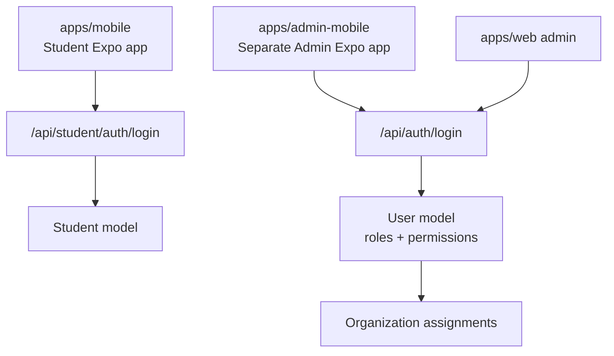
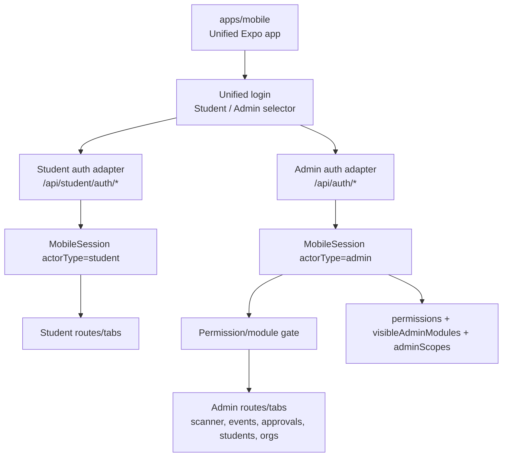

# Unified Mobile Role Architecture

**Status:** In progress  
**Last updated:** 2026-06-14  
**Source of truth:** `apps/mobile` is the long-term mobile app for both student and admin actors.

## Previous Split Architecture



## Target Architecture



## Phase Tracker

| Phase | Status | Notes |
|---|---|---|
| Phase 1: Mobile auth foundation | In Progress | Unified session store, role-aware login, actor-based refresh/bootstrap. |
| Phase 2: Unified login and routing | In Progress | One login screen routes students to tabs and admins to admin tabs. |
| Phase 3: Permission-driven admin mobile | In Progress | Admin shell, scanner, event list, and permission-gated tabs live in `apps/mobile`; approvals/students/organizations still need deeper workflows. |
| Phase 4: Backend and contract hardening | In Progress | Admin refresh returns RBAC data; optional `User.studentId` link added; scanner authorization supports scoped permission. |
| Phase 5: Retire separate admin mobile app | Done | `apps/admin-mobile` and root `admin-mobile:*` scripts were removed after scanner migration into `apps/mobile`. |

## Auth And Session Contract

```ts
type StudentMobileSession = {
  actorType: 'student';
  accessToken: string;
  refreshToken: string;
  student: StudentProfile;
};

type AdminMobileSession = {
  actorType: 'admin';
  accessToken: string;
  refreshToken: string;
  profile: AuthProfile;
};

type MobileSession = StudentMobileSession | AdminMobileSession;
```

Storage key: `cict_mobile_session_v1`.

Legacy student token keys are still read during bootstrap and migrated into the versioned session shape.

## Role And Access Matrix

| Actor | Account Source | Mobile Area | Access Rule |
|---|---|---|---|
| Student | `Student` model | Student tabs | Valid student session |
| Admin | `User` model | Admin tabs | Backend RBAC payload |
| Student + Admin | Linked `Student` + `User` | Either login mode | User chooses Student or Admin on login |
| Scoped org admin | `User` + organization assignment | Limited admin tabs | Scoped permissions and visible modules |
| Inactive user/student | Existing account | No access | Backend rejects login/profile |

## Admin Tab Gate

| Mobile Tab | Access Source |
|---|---|
| Dashboard | `canAccessAdmin`, visible modules, or scoped modules |
| Scanner | `SCAN_EVENT_ATTENDANCE` global or scoped |
| Events | `events` module or event/scanner permissions |
| Approvals | approval/member-management permissions |
| Students | `VIEW_STUDENT` |
| Organizations | organization module or organization management permissions |
| Settings | Any authenticated admin session |

## Migration Checklist

| Item | Status |
|---|---|
| Move admin auth into `apps/mobile` | Done |
| Move admin route shell into `apps/mobile` | Done |
| Move admin event list into `apps/mobile` | Done |
| Migrate camera scanner | Done |
| Migrate manual attendance entry | Done |
| Migrate recent scans and undo | Done |
| Migrate approvals queue | Planned |
| Migrate student lookup | Planned |
| Migrate organization admin tools | Planned |
| Remove root `admin-mobile:*` scripts | Done |
| Remove/archive `apps/admin-mobile` | Done |

## Release Acceptance

- `pnpm --filter @cict/contracts build`
- `pnpm --filter @cict/mobile lint -- --max-warnings=0`
- `pnpm --filter @cict/mobile typecheck`
- `pnpm --filter @cict/mobile test:ci`
- `pnpm --filter @cict/mobile release:check`

CI must fail if Expo packages drift, Expo Doctor fails, Android export fails, or the unified mobile release gate fails.
