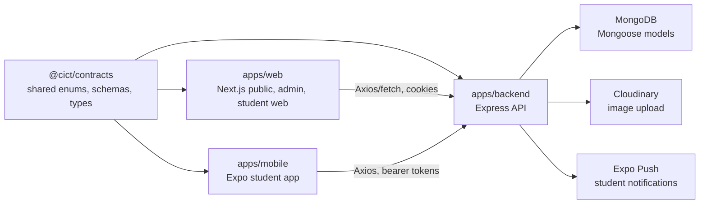
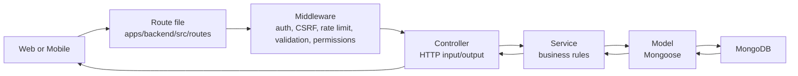
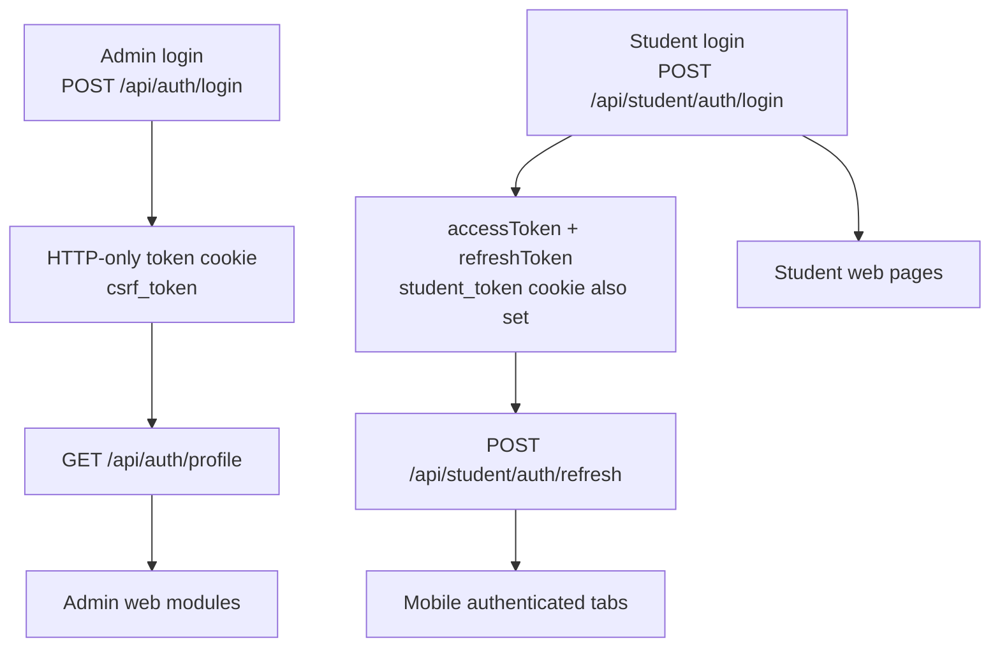
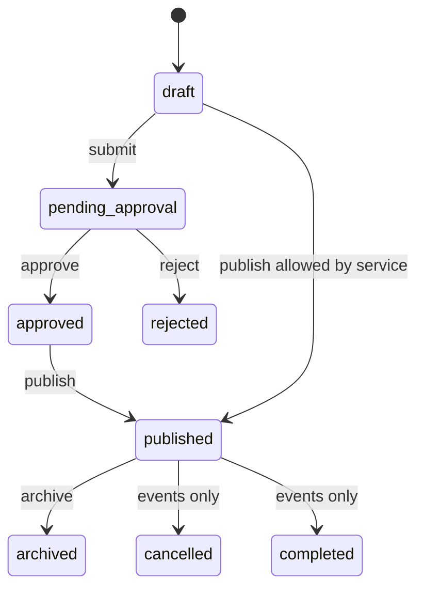
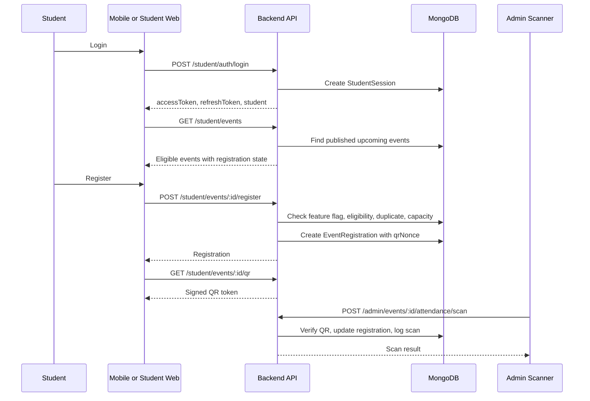
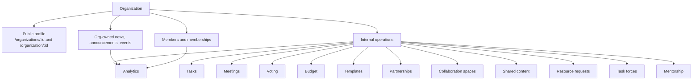
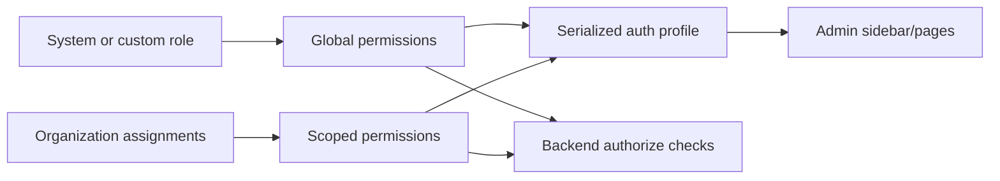
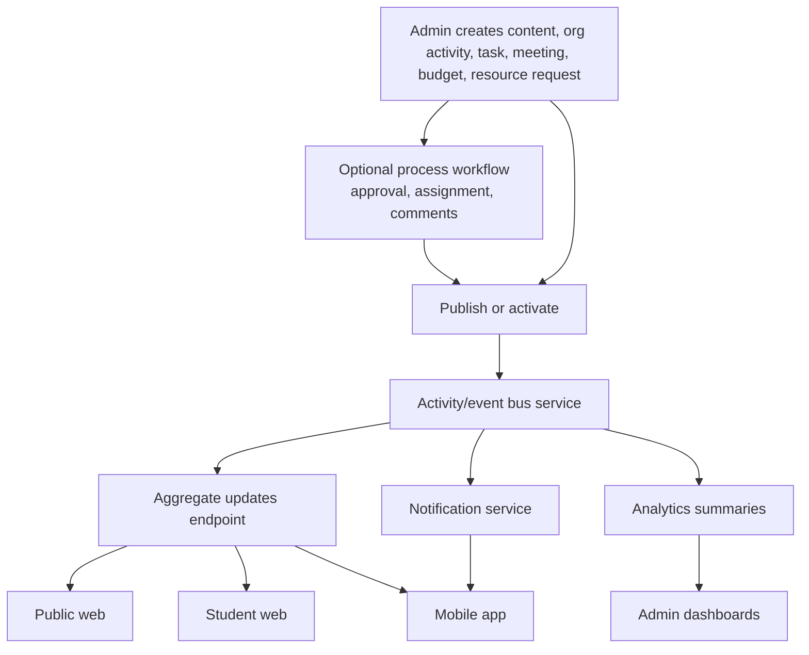

# CICT System Logic and Connectivity Audit

Last inspected: 2026-06-02  
Scope: `apps/backend`, `apps/web`, `apps/mobile`, and `packages/contracts` in the current local worktree.

This document maps what each major feature is meant to do, how it is connected across backend, web, mobile, and shared contracts, and what should be connected next to make the system feel more dynamic and cohesive.

## Executive Summary

CICT is structurally sound: the backend is the system of record, the web app consumes it through API clients and TanStack Query, the mobile app consumes student-focused APIs through Axios and React Query, and shared enums/types live in `@cict/contracts`.

The main system purpose is clear:

- Public site: publish CICT news, announcements, events, organizations, members, FAQ, and college identity.
- Admin CMS: manage content, users, roles, students, events, attendance, approvals, organizations, and operational organization tools.
- Student mobile and student web: authenticate students, browse eligible events, register, show QR attendance passes, see updates, view organizations, and manage memberships.
- Backend API: enforce auth, ownership, permissions, validation, workflow state, persistence, media upload, logging, and cache invalidation.

The strongest connected flows today are:

- News, announcements, and events from admin CMS to public website and updates hub.
- Student event registration, QR generation, admin scanning, and attendance logs.
- Admin RBAC, role metadata, organization-scoped assignments, and visible admin modules.
- Organization records and public organization/member pages.
- Organization admin modules at the route/API/page level: tasks, meetings, voting, budget, templates, analytics, partnerships, collaboration, shared content, resources, task forces, mentorship.

The biggest gaps for a more dynamic feel are:

- Public informational pages are still static or placeholder: About, Academics, Admissions, Student Life, and Contact.
- Some organization admin expansion modules are connected to backend APIs, but use manual IDs/slugs instead of search/picker relationships.
- Some organization operation routes only require admin access, while the UI and contracts imply module-specific permissions should be enforced.
- The updates hub merges client-side feeds from separate endpoints; a backend aggregate feed would support richer filtering, ranking, and cross-platform consistency.
- Media upload has two active Cloudinary paths and one apparent unmatched S3 presigned helper.
- Admin web has a refresh-token helper for `/auth/refresh-token`, but the backend exposes no matching admin refresh route.
- `apps/backend/.env.example` is missing `STUDENT_REFRESH_SECRET`, even though `validateEnv` requires it.

## High-Level Architecture

## Backend Request Pattern

Most backend modules follow this shape:

Main backend route mounting is in `apps/backend/src/app.ts`.

## Auth and Identity Connectivity

### What Is Connected

Admin auth is cookie-based on web:

- Web client: `apps/web/src/lib/api/axios.ts`
- Context: `apps/web/src/context/AuthContext.tsx`
- Backend routes: `apps/backend/src/routes/auth.routes.ts`
- Backend middleware: `apps/backend/src/middleware/auth.ts`

Student auth exists for both web and mobile:

- Web student API: `apps/web/src/lib/api/student.ts`
- Web context: `apps/web/src/context/StudentAuthContext.tsx`
- Mobile API client: `apps/mobile/src/services/api/client.ts`
- Mobile auth store: `apps/mobile/src/store/auth-store.ts`
- Backend routes: `apps/backend/src/routes/student-auth.routes.ts`
- Backend middleware: `apps/backend/src/middleware/studentAuth.ts`

### Needs Connection

| Gap | Why It Matters | Suggested Connection |
|---|---|---|
| Admin refresh helper calls `/auth/refresh-token`, but backend does not expose it | Dead or mismatched API code creates confusing auth behavior later | Either remove `apps/web/src/lib/api/refreshToken.ts` or add a real admin refresh-token flow |
| `.env.example` lacks `STUDENT_REFRESH_SECRET` | Backend startup validation requires it | Add `STUDENT_REFRESH_SECRET` to `apps/backend/.env.example` |
| Student web and mobile use different token handling styles | It works, but cross-platform auth behavior can drift | Standardize documented student auth behavior: cookie for web, bearer token plus refresh token for mobile |

## Feature Connectivity Matrix

Status meanings:

- Connected: backend, client surface, and purpose are aligned.
- Partly connected: useful wiring exists, but missing dynamic pieces or polish.
- Backend-heavy: backend exists, client is thin or incomplete.
- Client-heavy: UI exists but backend linkage is weak or mismatched.
- Placeholder: feature route exists but purpose is not implemented yet.

| Feature | Purpose | Backend | Web | Mobile | Status | Needed For Dynamic Feel |
|---|---|---|---|---|---|---|
| Public landing page | CICT front door, highlights content and orgs | News, announcements, events, FAQ, org APIs | `LandingPage`, dynamic news/events/FAQ/org sections | Not applicable | Partly connected | Replace static testimonial/random external images with CMS-backed testimonials or student/org highlights |
| Updates hub | Unified stream of news, announcements, events, org activity | Separate `/news`, `/public/announcements`, `/events`, `/organizations` | `apps/web/src/lib/updates-hub.ts`, `UpdatesHubClient` | `useUpdatesHub` merges news, public announcements, student events | Connected, but client-aggregated | Add `/api/updates` aggregate endpoint with ranking, source filters, organization filters, pagination |
| News CMS | Create, review, publish, archive articles | `news.routes`, `news.service`, approval service, cache | Admin news pages, public news list/detail, landing | Mobile news list/detail | Connected | Add richer related content and organization picker UX in forms |
| Announcements CMS | Publish urgent/general notices | Admin `/announcements`, public `/public/announcements` | Admin announcements, public announcements, updates hub | Mobile announcements list/detail | Connected | Add scheduling/expiration UI and push-notification targeting |
| Events CMS | Publish events with eligibility and registration rules | `event.routes`, `student.routes`, admin event routes | Admin events, public events, student web event flows | Mobile event list/detail/register/QR | Connected | Add calendar feed/integration and clearer student eligibility explanations |
| Student event registration | Let students register, cancel, and show QR pass | `student-event.controller`, `event-registration.service` | Student web events/QR | Mobile events/QR | Strongly connected | Add waitlist, reminders, and notification triggers |
| Admin attendance scanning | QR/manual scan, logs, CSV export | `admin-event-attendance.controller` | Admin event scan/details pages | Not mobile admin | Connected | Add live scan dashboard updates and offline scan queue if needed |
| Users and roles | Admin access control | `user.routes`, `role.routes`, `rbac.ts` | Admin users/roles pages | Not applicable | Connected | Add visual permission diff and role impact preview |
| Organization records | Public and admin org profiles | `organization.routes`, `organization.service` | Public org pages, admin org pages, landing org spotlight | Mobile org list/detail | Connected | Add org activity timeline from events/news/announcements/tasks |
| Organization memberships | Student applies, admins approve/reject, members shown | `organization-membership.routes`, student membership routes | Admin membership manager, student org pages | Mobile membership API exists | Partly connected | Surface membership status more consistently in org detail screens |
| Organization tasks | Internal org task tracking | `org-task.routes`, `org-task.service` | Admin org task page | Not mobile | Connected at admin level | Add assignee picker, due-date reminders, dashboard rollups |
| Organization meetings | Meeting records, minutes, action items | `org-meeting.routes`, `org-meeting.service` | Admin org meetings page | Not mobile | Connected at admin level | Connect action items into org tasks automatically |
| Organization voting | Org elections/polls | `org-vote.routes`, `org-vote.service` | Admin org voting page | Not mobile | Backend/admin connected | Decide if student members should vote through mobile/web student app |
| Organization budget | Budget, categories, transactions | `org-budget.routes`, `org-budget.service` | Admin org budget page | Not mobile | Connected at admin level | Add receipt upload picker and approval workflow |
| Organization templates | Apply org structure templates | `/api/org-templates` | Admin org templates page | Not mobile | Connected | Connect template application to org onboarding checklist |
| Organization analytics | Roll up org activity and operations | `org-analytics.routes`, `org-analytics.service` | Admin analytics dashboard | Not mobile | Connected | Add cached summary endpoint and date-range comparisons |
| Partnerships | Cross-org relationship management | `org-partnership.routes` | Admin partnerships page | Not mobile | Partly connected | Replace manual org slug entry with organization search/select |
| Collaboration spaces | Cross-org spaces and messages | `org-collaboration.routes` | Admin collaborations page | Not mobile | Partly connected | Add realtime or polling messages, members/participants, notifications |
| Shared content | Share content across organizations | `org-shared-content.routes` | Admin shared-content page | Not mobile | Partly connected | Replace manual content ID and org slug entry with content/org pickers |
| Resource requests | Request/approve shared resources | `org-resource.routes` | Admin resources page | Not mobile | Partly connected | Replace provider slug input with org picker, add resource catalog |
| Task forces | Temporary cross-functional teams | `org-task-force.routes` | Admin task-forces page | Not mobile | Connected at admin level | Connect members, tasks, meetings, and analytics |
| Mentorship | Org-to-org mentorship | `org-mentorship.routes` | Admin mentorship page | Not mobile | Partly connected | Replace mentee slug input with org picker, add milestones |
| Process/workflow builder | Reusable workflow templates and instances | `process.routes`, `process-engine.service` | Admin process pages and flow components | Not mobile | Connected as standalone workflow | Tie content approval, budget approval, and resource requests into process instances |
| FAQ | Public FAQ with admin editing | `faq.routes` | Landing FAQ, admin FAQ | Not mobile | Connected | Add categories/search to public standalone FAQ page if wanted |
| Settings | System configuration | `settings.routes` | Admin settings page | Not mobile | Connected | Use settings to control public content flags, registration behavior, and maintenance messaging |
| Audit logs | Activity log browsing and summary | `audit.routes`, activity logger | Admin logs API/page | Not mobile | Connected | Add filters by actor type, organization, content type, and export |
| Push notifications | Student mobile reminders/tokens | `pushToken.routes`, push notification service | Not web | Mobile notification registration | Partly connected | Trigger notifications from publish, event registration, reminders, task assignments |
| Media upload | Upload images to Cloudinary | `/api/uploads/images`, `/api/organizations/upload`, upload middleware | News/event/announcement/gallery/org forms | Not mobile | Partly connected | Unify media API and remove or implement unmatched S3 presigned helpers |
| About/Academics/Admissions/Student Life | Public college info pages | No dedicated CMS module yet | ComingSoon placeholders | Not mobile | Placeholder | Add CMS-backed page sections or structured content records |
| Contact page | Public contact path | No backend contact/settings module specific to page | Empty page shell | Not mobile | Placeholder | Connect to settings/org contact data and optional contact form |

## Content Publishing Logic

News, announcements, and events share a similar lifecycle.

### What Is Connected

- Admin create/update/delete routes are protected.
- Public reads are filtered to published content unless an authenticated admin has permission.
- Ownership supports system-level and organization-owned content.
- Approval actions are recorded through `ContentApprovalAction`.
- Dashboard/list caches are invalidated when content changes.
- Web public pages, landing page, and updates hub consume published content.
- Mobile consumes public news and announcements, and student-eligible events.

### Needs Connection

| Gap | Suggested Fix |
|---|---|
| Content approval and process workflow are separate systems | When content is submitted, optionally create/link a `ProcessInstance`; show workflow state on content pages |
| Updates hub is assembled on the client from multiple endpoints | Add a backend aggregate feed that handles pagination, ranking, search, owner filters, and mixed content consistently |
| Organization-owned content needs better authoring UX | Forms should use organization picker and scoped defaults based on the logged-in admin assignment |

## Student Event and Attendance Logic

### What Is Connected

- Eligibility uses program, year level, and section targeting.
- Registration checks event status, registration open flag, deadline, duplicate, and capacity.
- QR token includes event, registration, student, QR version, and nonce.
- Admin scan verifies QR token and logs attendance.
- Attendance history is exposed to student surfaces.

### Needs Connection

| Gap | Suggested Fix |
|---|---|
| Student event reminder logic is not visibly tied to event registration lifecycle | On registration, schedule local/mobile notification or backend push reminder |
| Registration counts can be more visible | Surface capacity and waitlist state in public event cards and student event detail |
| Admin scan UI can feel static after scan | Poll or subscribe to updated attendance summary after each scan |

## Organization Logic

Organization is the biggest domain in the app. It is both a public showcase and an admin operations workspace.

### What Is Connected

- Public organization pages load real organization records.
- Admin organization pages are nested under `/admin/organizations/[id]`.
- The organization sub-navigation exposes many connected operational modules.
- Web API clients exist for each operation module.
- Backend models/services/controllers/routes exist for each operation module.
- Analytics pulls from several organization module datasets.

### Needs Connection

| Gap | Why It Matters | Suggested Fix |
|---|---|---|
| Several org operation routes only apply `authenticate` and `requireAdminAccess` | UI-level permission checks can be bypassed by direct API calls | Add module-specific `authorize(...)` or scoped permission checks to org task, meeting, vote, budget, partnership, collaboration, shared content, resource, task force, and mentorship routes |
| Manual slug/content ID inputs in partnership/resource/shared-content/mentorship forms | Users must know internal IDs, which makes the system feel less dynamic | Add reusable organization picker, content picker, member picker |
| Org tools are separate silos | Tasks, meetings, budgets, task forces, and analytics should reinforce each other | Let meeting action items create tasks; budget transaction receipts use media upload; task forces own tasks/meetings |
| Student organization membership is not as visible as admin organization management | Students should feel org membership as part of their app identity | Show membership status on mobile org detail and home, with apply/resign actions where appropriate |

## Permission and Scope Logic

The codebase has strong shared permission vocabulary in `packages/contracts/src/index.ts` and backend `rbac.ts`.

### What Is Connected

- Auth profile serializes effective permissions, admin scopes, visible modules, and organization assignments.
- Web `usePermissions` derives visible modules and organization-scoped access.
- Backend has `authorize`, `authorizeAny`, `requireAdminAccess`, and ownership-scope helpers.
- Content and event registration admin flows use ownership-scoped permission checks in service/controller logic.

### Needs Connection

The permission model is better than some route files currently enforce. For a secure and predictable system, backend routes should enforce the same intent the UI presents.

Priority permission checks to add:

| Route Family | Current Gate | Better Gate |
|---|---|---|
| `/:orgId/tasks` | Admin access | `MANAGE_ORG_TASKS` globally or scoped to org |
| `/:orgId/meetings` | Admin access | `MANAGE_ORG_MEETINGS` globally or scoped to org |
| `/:orgId/votes` | Admin access | `MANAGE_ORG_VOTES` globally or scoped to org |
| `/:orgId/budget` | Admin access | `MANAGE_ORG_BUDGET` globally or scoped to org |
| `/:orgId/partnerships` | Admin access | `MANAGE_ORG_PARTNERSHIPS` globally or scoped to org |
| `/:orgId/collaborations` | Admin access | `MANAGE_ORG_COLLABORATION` globally or scoped to org |
| `/:orgId/shared-content` | Admin access | `SHARE_CONTENT_CROSS_ORG` globally or scoped to org |
| `/:orgId/resource-requests` | Admin access | `MANAGE_ORG_RESOURCE_POOLING` globally or scoped to org |
| `/:orgId/task-forces` | Admin access | `MANAGE_ORG_TASK_FORCES` globally or scoped to org |
| `/:orgId/mentorships` | Admin access | `MANAGE_ORG_MENTORSHIP` globally or scoped to org |

## API Surface Connectivity

### Connected API Groups

| API Prefix | Primary Purpose | Current Clients |
|---|---|---|
| `/api/auth` | Admin login/profile/password/logout/permission metadata | Web admin |
| `/api/student/auth` | Student login/refresh/logout/profile/password | Web student, mobile |
| `/api/news` | Admin and public-aware news listing/details/actions | Web public/admin, mobile |
| `/api/announcements` | Admin announcement management | Web admin |
| `/api/public/announcements` | Public announcements | Web public, mobile |
| `/api/events` | Admin and public-aware event listing/details/actions | Web public/admin, mobile public detail |
| `/api/student/events` | Student event eligibility, registration, QR | Web student, mobile |
| `/api/admin/events` | Registration management and attendance scan/logs | Web admin |
| `/api/organizations` | Public orgs, admin orgs, org tools | Web public/admin, mobile org browsing |
| `/api/admin/students` | Student directory and admin student management | Web admin |
| `/api/admin/academic` | Programs, year levels, sections | Web admin |
| `/api/roles` | Role CRUD | Web admin |
| `/api/users` | User CRUD and org assignments | Web admin |
| `/api/admin/approvals` | Approval queue/history/stats | Web admin |
| `/api/admin/processes` | Templates and workflow instances | Web admin |
| `/api/faqs` | Public FAQ read and admin FAQ edit | Web landing/admin |
| `/api/audit` | Logs and summary | Web admin |
| `/api/uploads/images` | Cloudinary multi-image upload | Web admin |
| `/api/student/push-token` | Mobile push token registration | Mobile |

### Mismatched or Suspicious API Groups

| Client Code | Expected Backend | Finding |
|---|---|---|
| `apps/web/src/lib/api/media/getPresignedUrl.ts` | `/api/media/presigned-url` | No matching backend route found; active backend media path is Cloudinary upload |
| `apps/web/src/lib/api/media/uploadToS3.ts` | S3 presigned upload | No matching backend media route found; likely stale or planned |
| `apps/web/src/lib/api/refreshToken.ts` | `/api/auth/refresh-token` | No matching admin auth route found |
| Backend `event.routes` join/leave | `/api/events/:id/join`, `/leave` | Deprecated response says use student registration flow instead |

## Public Website Dynamic Gaps

Current public pages:

| Page | Current State | Recommended Dynamic Source |
|---|---|---|
| Home | Dynamic content sections plus some static sections | Continue connecting to updates aggregate, organizations, FAQ, testimonials |
| News | Dynamic | `/api/news?status=published` |
| Announcements | Dynamic | `/api/public/announcements` |
| Events | Dynamic | `/api/events?status=published&upcoming=true` |
| Updates | Dynamic but client-aggregated | New `/api/updates` |
| Organizations | Dynamic detail pages | `/api/organizations` |
| Members | Dynamic detail pages | `/api/members/:memberId` |
| About | ComingSoon | CMS page sections or settings-backed content |
| Academics | ComingSoon | Programs/year levels/sections plus CMS content |
| Admissions | ComingSoon | CMS content plus requirements/checklist |
| Student Life | ComingSoon | Organizations, events, achievements, testimonials |
| Contact | Empty shell | Settings, organization contact info, contact form |

## Recommended Dynamic Data Model Additions

These are not mandatory for correctness, but they would make the system feel alive.

| Proposed Addition | Purpose | Connects To |
|---|---|---|
| `PageContent` or `StructuredPage` model | Manage About, Contact, Admissions, Academics, Student Life without code edits | Public pages, admin CMS |
| `/api/updates` aggregate endpoint | One ranked mixed feed for web and mobile | News, announcements, events, organizations |
| `Testimonial` or `Spotlight` model | Replace static testimonials and external random images | Landing, Student Life |
| `OrgActivity` aggregate endpoint | Timeline of org news, events, meetings, tasks, public achievements | Public org page, admin org dashboard, mobile org detail |
| `NotificationEvent` service | Centralize push/email triggers | Publish actions, registration, approvals, tasks |
| `MediaAsset` model or unified media service | Track uploads, ownership, reuse, alt text, captions | News/events/announcements/orgs/budget receipts |

## Prioritized Connection Work

### Priority 1: Correctness and Security

1. Add `STUDENT_REFRESH_SECRET` to `apps/backend/.env.example`.
2. Decide whether admin refresh tokens exist. Remove `apps/web/src/lib/api/refreshToken.ts` or implement `/api/auth/refresh-token`.
3. Remove or implement the unmatched S3 presigned media helpers.
4. Add backend permission gates to organization operation routes, matching the permission names already in contracts.

### Priority 2: Dynamic UX

1. Build reusable admin pickers:
   - Organization picker
   - Student/member picker
   - Content picker for news/events/announcements
   - User/role picker
2. Replace manual org slug and content ID fields in partnerships, resources, shared content, and mentorship.
3. Add `/api/updates` so web and mobile share one updates logic.
4. Add org activity timeline data to public org pages and mobile org details.

### Priority 3: Product Cohesion

1. Connect process instances to content approval, budget approval, and resource requests.
2. Let meeting action items create tasks.
3. Let task forces own tasks, meetings, and analytics.
4. Trigger notifications from publish, approval, registration, task assignment, meeting reminders, and QR/event reminders.
5. Turn About, Academics, Admissions, Student Life, and Contact into CMS-backed pages.

## Suggested Target Architecture For Dynamic Feel

## Final Assessment

The system is not just a static website with a CMS bolted on. It already has a real operational core: roles, scoped permissions, content workflows, student event registration, attendance QR logic, organization operations, process templates, analytics, audit logs, and mobile API consumption.

The main work now is not inventing the system from scratch. It is tightening the connections:

- Make backend permissions match the UI permission model.
- Replace manual IDs with relational pickers.
- Aggregate feeds and activity server-side.
- Connect workflow/process logic to real business actions.
- Convert placeholder public pages into CMS-backed pages.
- Unify media and auth helper paths so every client API has a backend owner.

Once those are done, CICT will feel less like separate modules and more like one living campus platform.
